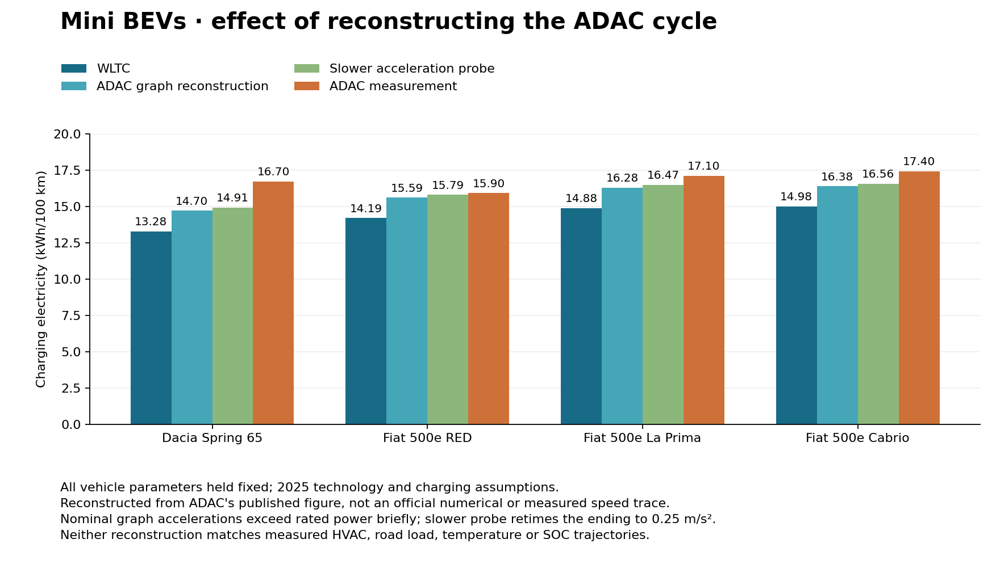
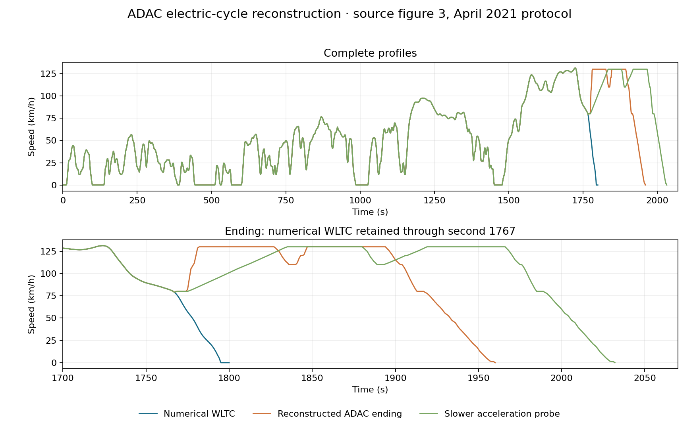

ADAC electric-cycle sensitivity for mini BEVs
=============================================

The cycle-only experiment substantially reduces the Fiat 500 discrepancies,
while the Dacia Spring remains low. This is a **graph-based reconstruction**,
not an official ADAC numerical trace or a reproduction of individual tests.
No vehicle parameters or production defaults were changed or fitted.

Source and reconstruction
-------------------------

The `ADAC April 2021 protocol <https://assets.adac.de/image/upload/v1721027897/ADAC-eV/KOR/Text/PDF/ecotest-methodik-ab-04-2021_pg5juw.pdf>`_
publishes the electric cycle as figure 3 on page 3. The electric cycle combines
WLTC with an adjusted motorway portion; charging losses are included in the
reported electricity. The `February 2019 protocol <https://www.adac.de/-/media/pdf/tet/ecotest/ecotest-methodik-ab-02-2019.pdf>`_
contains a visually matching electric-cycle diagram on page 4. The 2026
replacement procedure is outside this experiment.

The search found a numerical motorway-cycle lead in the MathWorks Powertrain
Blockset Drive Cycle Data add-on, but did not obtain an original, verified full
ADAC electric-cycle file. The add-on's motorway cycle alone would not establish
the electric-cycle assembly used by the tests.

The reconstruction retains the packaged numerical WLTC through second 1767,
then extracts the ending from the original embedded 1008-by-649-pixel graph.
Axis coordinates, source hashes and the extraction algorithm are recorded.
The nominal result has 1961 samples and a distance of 28.432 km. Raster
resolution is approximately 2.1 seconds per horizontal pixel. The visible
moving WLTC prefix differs from the numerical trace by a median 0.92 km/h
and a 95th percentile 8.36 km/h, so the graph is not precise enough to
establish an exact time-by-time match. Keeping the numerical prefix avoids
introducing raster noise into its accelerations.

Two sensitivity traces stretch or compress only the ending by 5%. These are
illustrative timing changes, **not confidence bounds**. A further probe extends
positive acceleration ramps in the ending to at most 0.25 m/s2, retaining the
speed waypoints and dwell periods. That probe changes both duration and distance
and is not an ADAC trace.

Results
-------

All values below are charging electricity in kWh/100 km, including the model's
battery and charging losses.

.. list-table:: Unchanged 2025 vehicle configurations
   :header-rows: 1

   * - Vehicle
     - WLTC
     - Graph reconstruction
     - Slower acceleration probe
     - ADAC measurement
   * - Dacia Spring 65
     - 13.28 (-20.5%)
     - 14.70 (-12.0%)
     - 14.91 (-10.7%)
     - 16.70
   * - Fiat 500e RED
     - 14.19 (-10.8%)
     - 15.59 (-1.9%)
     - 15.79 (-0.7%)
     - 15.90
   * - Fiat 500e La Prima
     - 14.88 (-13.0%)
     - 16.28 (-4.8%)
     - 16.47 (-3.7%)
     - 17.10
   * - Fiat 500e Cabrio
     - 14.98 (-13.9%)
     - 16.38 (-5.9%)
     - 16.56 (-4.8%)
     - 17.40

The nominal graph trace exceeds rated shaft power for 11 seconds in the Spring,
7 in the RED, and 6 in each other Fiat. Requested energy was not clipped to hide
these exceedances. The slower-acceleration probe has no rated-power exceedances
in any of the four vehicles and gives the same qualitative conclusion.
The timing-only variants change consumption by less than 0.05 kWh/100 km from
the nominal reconstruction; this narrow sensitivity does not bound the omitted
test conditions or uncertainty in the graph.

This supports investigating cycle mismatch before adjusting the mini-BEV
component assumptions. It does not establish that the remaining differences are
model defects: auxiliary/HVAC demand, road load, temperature, charging efficiency,
and battery state trajectories still differ or are not known. The Spring
remains the clearest residual among these four configurations.

Verification and reproducibility
--------------------------------

The final experiment completed 24 full model runs: named WLTC, custom-array
WLTC, nominal reconstruction and three sensitivities for each of four vehicles.
Named-WLTC consumption reproduces the preceding committed comparison within
0.00001 kWh/100 km. Custom-array WLTC agrees within the same tolerance.
Both final and energy-input masses match the documented targets within 0.1 kg.
All reported energy outputs are finite and positive. No package physics or
parameter changes were necessary; this is a research-only experiment.

Use the model Python 3.12 environment for the runner, and an environment with
NumPy/Pillow/Matplotlib plus Poppler's ``pdfimages`` for extraction and plotting::

    python scripts/reconstruct_adac_electric_cycle.py --pdf /tmp/adac-ecotest-2021.pdf --output /tmp/adac-cycles
    python scripts/compare_adac_electric_cycle.py --cycles /tmp/adac-cycles --output /tmp/adac-cycles/sensitivity
    python scripts/plot_adac_cycle_comparison.py --data /tmp/adac-cycles

The extractor pins the downloaded PDF hash and rejects a changed document.
The earlier 20-run ``results`` snapshot is retained as investigation history;
``sensitivity`` is the final 24-run snapshot including the power-feasibility probe.

* :download:`Comparison figures (PDF) <_static/energy_validation_2025/adac_cycle/adac_cycle_comparison.pdf>`
* :download:`Results (CSV) <_static/energy_validation_2025/adac_cycle/sensitivity/comparisons.csv>`
* :download:`Nominal reconstructed trace (CSV) <_static/energy_validation_2025/adac_cycle/adac_graph_nominal.csv>`
* :download:`Reconstruction provenance (JSON) <_static/energy_validation_2025/adac_cycle/reconstruction.json>`
* :download:`Run provenance (JSON) <_static/energy_validation_2025/adac_cycle/sensitivity/provenance.json>`

An exact comparison still requires ADAC's numerical electric-cycle definition,
its version and phase boundaries, and preferably vehicle-specific actual speed,
road-load and auxiliary records. In particular, the full-throttle portions of
the motorway protocol should not be assumed to follow one identical feasible
speed trace for every power-to-mass ratio. No external data request has been sent.
