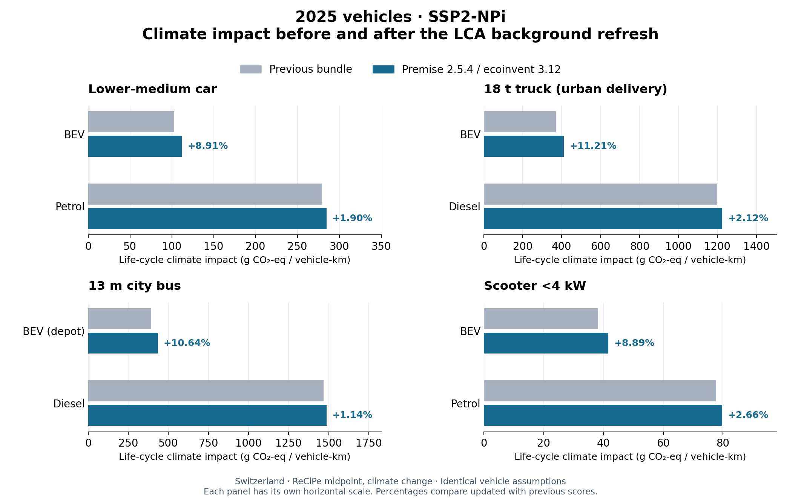

Rebuilding the LCA background
=============================

The development workflow in ``dev/rebuild_iam.py`` replaces the interactive
database-building notebook. It builds isolated premise databases and compiles
a candidate resource bundle. It does not overwrite the installed package data.
The database-generation environment is separate from carculator's runtime and
its optional legacy Brightway export environment.

Source and scenario boundary
----------------------------

The refresh targets **premise 2.5.4** and **ecoinvent 3.12 cutoff**, using the
ecoinvent 3.12 biosphere and LCIA methods. The premise version was checked against
`PyPI <https://pypi.org/project/premise/2.5.4/>`_ on 9 October 2026.
The older notebook, last modified in February 2025, uses ecoinvent 3.10.
``dev/update_iam_b_matrices.py``, committed in April 2026, updates only matched B
columns and retains unmatched old values. That older script is not a complete
background rebuild.

The build plan contains thirteen databases:

* A static database with premise's supplementary inventories and no scenario
  transformations.
* REMIND SSP2-NPi for 2005, 2010, 2020, 2030, 2040 and 2050.
* REMIND SSP2-PkBudg1000 and SSP2-PkBudg650 for 2030, 2040 and 2050.

The prospective databases apply all default premise sectors. Historical B
matrices use the same NPi background for all pathways. Vehicle years between
the tabulated years, including 2025, retain the runtime's interpolation.
Foreground recipes in A come from the static database; prospective changes
enter through the background suppliers characterized in B. This is the
existing carculator foreground/background boundary, not a claim that every
foreground technology changes with the IAM scenario.

Matrix conventions
------------------

``A_matrix.npz`` and ``dict_inputs_A_matrix.csv`` share one product/activity
ordering. ``dev/iam_foreground.csv`` explicitly identifies expanded recipes.
Other activity columns and elementary-flow pseudo-products have identity
columns. Production retains its original amount and sign, including waste
activities with negative reference production. Duplicate exchanges add.

B is a table of **precomputed LCIA coefficients**, not a biosphere exchange
matrix. It contains full supply-chain scores for background suppliers,
characterization factors for direct elementary flows, and zeroes for expanded
foreground columns. Consequently, a foreground unit demand is calculated as
``B @ solve(A, demand)`` without counting foreground impacts twice.

The compiler rebuilds all supported ReCiPe midpoint, ReCiPe endpoint and EF
midpoint rows. The custom Cucurachi noise factors are preserved explicitly by
their full elementary-flow labels: these factors are not supplied by ecoinvent.
No unmatched supplier inherits an old coefficient. Missing suppliers, ambiguous
matches, invalid migration weights, missing methods and nonfinite coefficients
stop compilation.

Dataset migrations
------------------

Official ecoinvent replacement and disaggregation records bundled with premise
are applied in order, from 3.10 to 3.11 and then to 3.12. Disaggregated suppliers
retain their stated weights. ``dev/iam_migration_policy.json`` documents the
exceptions that require a source-based decision:

* The organic-chemical market follows the replacement retaining its original
  reference-product UUID, resolving conflicting entries in the migration file.
* Electrolyzer treatment and captured-CO2 activities follow their revised names
  and reference products. Capture-only and capture-and-storage remain distinct.
* The old biomass IGCC CCS activity was labelled ``pre`` despite purchasing
  post-combustion capture. It follows the updated ``post`` inventory, including
  its revised auxiliary demand.
* Biological methanation now uses the regional low-pressure hydrogen market
  in the source inventory, replacing the former direct PEM-electrolysis input.
  Its stoichiometric requirements remain 0.5 kg hydrogen and 2.75 kg captured
  CO2 per kg methane; a synthetic route does not imply low-carbon hydrogen.
* The former NMC-523 option is replaced by **NMC-532**, using the ecoinvent 3.12
  chemistry with Ni:Mn:Co = 5:3:2. This explicitly changes the chemistry: the
  old precursor recipe is not chemically equivalent, despite a matching label
  in a premise workbook. Ten obsolete generic NMC523/NMC622 intermediate columns
  are retired; the updated markets supply regional production chains. Existing
  capacity, mass-share, cycle-life and cost assumptions carry forward as modelling
  priors under the new name; this update does not independently recalibrate them.

Stable labels selected by the vehicle models remain logical identifiers. Build
reports record the actual supplier identities; labels alone do not establish
compatibility with an older ecoinvent export target. Matrix LCIA validation and
export linking are separate checks.

Running a rebuild
-----------------

Use Python 3.12 and a dedicated environment. The deterministic coefficient
workflow disables uncertainty in both the source and imported inventories.
Keep the licensed source data in a private Brightway project and copy that
project to a new name before building. The copy must contain
``ecoinvent-3.12-cutoff``, ``ecoinvent-3.12-biosphere`` and the ecoinvent 3.12
LCIA methods. Existing output databases are never overwritten.

.. code-block:: bash

   conda create -n carculator-iam-build -c conda-forge \
       python=3.12 numpy=1.26.4 scipy=1.13.1 scikit-umfpack=0.4.2 suitesparse
   conda activate carculator-iam-build
   python -m pip install -r dev/iam-build-requirements.txt
   # Set PREMISE_KEY securely in the environment; do not put it in source files.
   python dev/rebuild_iam.py \
       --project YOUR_COPIED_PROJECT \
       --workspace /tmp/carculator-iam-output

UMFPACK/SuiteSparse is required for reproducible sparse solves on these
ill-conditioned inventories. A plain pip virtual environment also needs the
native SuiteSparse libraries and headers, a C compiler, pkg-config and SWIG.
The tested macOS build used SuiteSparse 7.10.1, UMFPACK 6.3.5 and SWIG 4.5.1.
The requirements file records the tested pip environment; it does not install
native system libraries. The solver's condition warnings remain visible.

An optional ``--legacy-catalogue`` accepts a JSON list of exact 3.10 cutoff
activity labels (name, location, unit, reference product) to certify older
supplier availability. ``--legacy-39-catalogue`` does the same for 3.9, after
applying the reviewed 3.10-to-3.9 naming map. Availability is checked independently
for each target; absent catalogues make rebuilt exports fail closed for that
target. Catalogue hashes are recorded in ``background_mapping.json``.

Only encrypted IAM inputs are accepted. The workspace has a dedicated premise
cache, per-database logs, build manifests and a ``candidate`` directory.
``--build-only`` and ``--compile-only`` separate the stages. ``--resume`` skips
database builds with compatible completion manifests; it does not silently
replace existing databases or repair failed builds.

An initial build retaining imported uncertainty failed premise's duplicate-link
validation for a lithium inventory. The final deterministic builds disable both
source and imported uncertainty and pass validation without custom exchange
consolidations. Production amounts and aggregated exchange coefficients are
retained in the matrix compiler.

Review and verification
-----------------------

Before installing a candidate, require all databases and all 57 B matrices,
a matching A/index, finite coefficients, and a complete build manifest. The
compiler compares its adjoint LCIA calculations with forward Brightway runs,
and compares every static expanded foreground unit demand with the full
Brightway system. Review the changed supplier mappings and model-level changes
as well as these numerical checks.

Run completed car, truck, bus and two-wheeler model/LCIA cases across static and
prospective backgrounds, and the repository tests. After installing the reviewed
bundle, use ``scripts/verify_installation.py`` to verify packaged resources and
installed family smoke tests. A successful build does not independently validate
the scientific assumptions in every source inventory or IAM scenario.

Full licensed background inventories, source-project copies, IAM credentials,
intermediate databases and logs remain outside version control. Commit only the
derived package resources, source/mapping provenance and reproducible scripts.

Local verification of the 9 October 2026 bundle
-----------------------------------------------

The installed bundle contains 1,871 aligned rows and 440 expanded foreground
recipes. All thirteen databases passed forward/adjoint LCIA checks; all 440
static foreground demands reproduced the full Brightway system (relative
tolerance 1e-6, absolute tolerance 1e-11). All 57 B matrices were rebuilt.

``dev/validate_iam_models.py`` completed 28 inventory runs covering cars, trucks,
buses and two-wheelers, years 2025/2030/2050, all four background scenarios,
all three method groups for the static cases, and explicit NMC-532 cases.
The :download:`model comparison <_static/background_refresh_20261009.json>`
records the case definitions, old-bundle hashes and LCIA comparisons. The 138
comparable default vehicle mass, energy and capacity quantities did not change. Selected 2025 static ReCiPe climate results, in kg CO2-eq/vkm:

.. list-table:: Background refresh comparison (default chemistries)
   :header-rows: 1

   * - Vehicle
     - Powertrain
     - Previous bundle
     - Updated bundle
   * - Lower-medium car
     - BEV
     - 0.127008
     - 0.132453
   * - Lower-medium car
     - Petrol
     - 0.297416
     - 0.297451
   * - 18 t truck, urban delivery
     - BEV
     - 0.437377
     - 0.458715
   * - 18 t truck, urban delivery
     - Diesel
     - 1.248942
     - 1.249479
   * - 13 m city bus
     - BEV depot
     - 0.449593
     - 0.474063
   * - 13 m city bus
     - Diesel
     - 1.488244
     - 1.489044
   * - Scooter <4 kW
     - BEV
     - 0.048361
     - 0.050270
   * - Scooter <4 kW
     - Petrol
     - 0.084863
     - 0.084862

These are selected model cases, not measured validation targets or a bound on
changes for other years, scenarios or categories. For example, the 2020 Medium
car under SSP2-NPi changes from 0.266/0.354 to 0.273/0.361 kg CO2-eq/vkm for
diesel/petrol, while its BEV result changes from 0.134 to 0.151.

``dev/validate_iam_exports.py`` collects completed 2025 default and NMC-532
exports in the family environment (``--collect --inventories FILE``), then
checks exact destinations in a Brightway environment containing the
``ecoinvent-3.12-cutoff`` project (``--audit --inventories FILE --report FILE``).
The :download:`destination audit <_static/export_target_audit_ei312_20261009.json>`
records all ordinary suppliers and elementary flows in eight family exports
matching the destination.
The 24 custom noise identities still require a user-provided database/method.
This is an identity audit, not a GUI-import or cross-software LCIA test.

Installed-package verification passed **1,607 tests**: 1,262 shared, 77 car,
125 truck, 43 bus and 100 two-wheeler tests. Wheel and sdist-built wheel resources
matched the source hashes, and all four vehicle models completed offline smoke
runs from both artifact types. The final artifacts have byte-identical runtime
files to the wheels used for the installed suites. All five documentation builds
succeeded; two existing truck API-signature warnings remain. These are local
macOS/Python 3.12 results, not a cross-platform CI claim.

Climate-score comparison with the previous bundle
-------------------------------------------------

The previous bundle matches Git revision ``aeace0e53937870fa05ec8aeba392e41d75aaa0b``
(the index backup differs only in line endings). These comparisons hold the
vehicle models and assumptions fixed and change the aligned A/index/B bundle.
They use Switzerland, default battery chemistries and fuel blends, and the
ReCiPe midpoint ``climate change`` category excluding biogenic CO2. All scores
are per vehicle-kilometre. Car, bus and scooter use their default cycles; the
18 t truck uses Urban delivery.

For 2025 under the default SSP2-NPi scenario, BEV scores rise by 8.9–11.2%,
while combustion scores rise by 1.1–2.7%. The earlier 3.9–5.4% BEV increases
refer to the static background. Across all 96 comparisons (eight vehicles,
three manufacture years and four scenarios), the largest absolute percentage
change is +13.4% for the 2025 BEV truck under SSP2-PkBudg650.

Download the :download:`full comparison CSV
<_static/climate_refresh_comparison_20261009/climate_comparison.csv>`,
:download:`chart PDF <_static/climate_refresh_comparison_20261009/climate_2025_SSP2-NPi.pdf>`
and :download:`provenance <_static/climate_refresh_comparison_20261009/provenance.json>`.
``dev/compare_vehicle_climate.py`` reproduces these summaries and static/NPi
charts from the completed validation report. It checks the old Git revision
and current bundle hashes before use; matplotlib is needed for plotting.
