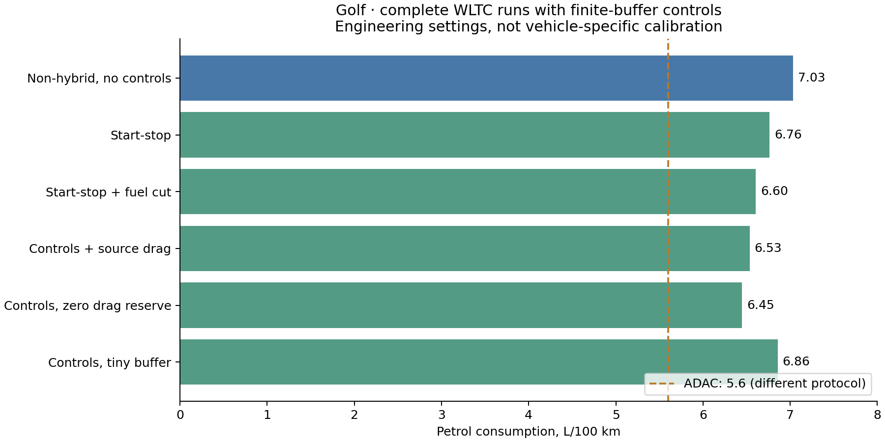

Conventional petrol-car operating controls
==========================================

A speed trace does not fully specify engine operation. Stopping the engine at
idle, selecting an operating load, or using a hybrid battery can change fuel use.
The optional controls below represent these choices with explicit energy
accounting; they are not manufacturer-specific control software.

``CarModel`` now supports opt-in start-stop and deceleration fuel cut through
``combustion_controls``. The controller conserves auxiliary service energy,
tracks a finite buffer causally, limits recharge power, and accounts for restart
and fuel-resumption costs. Generic vehicle defaults remain unchanged.

This is a tested implementation of configurable operating rules, **not a
calibrated Golf engine controller**. Default option values are engineering
assumptions. They do not establish a class-wide 2025 calibration.

Public API
----------

Controls use the same ``(powertrain, size, year)`` selection convention as other
vehicle overrides. The selected settings apply independently to each stochastic
sample. A complete example::

   from carculator import CarInputParameters, CarModel, fill_xarray_from_input_parameters

   inputs = CarInputParameters()
   inputs.static()
   _, array = fill_xarray_from_input_parameters(
       inputs,
       scope={"size": ["Lower medium"], "powertrain": ["ICEV-p"], "year": [2025]},
   )
   # This example represents a conventional car, without hybrid assistance.
   array.loc[dict(parameter="combustion power share")] = 1
   array.loc[dict(parameter="electric motor power share")] = 0
   model = CarModel(
       array,
       combustion_controls={
           ("ICEV-p", "Lower medium", 2025): {
               "start_stop": True,
               "deceleration_fuel_cut": True,
               "warmup_seconds": 120,
               "engine_drag_power_W": 5000,
           }
       },
   )
   model.set_all()

Omitting the mapping, or disabling both controls, preserves the original energy
path. Unknown options and out-of-scope coordinates raise errors. Configurations
are copied so later changes to the caller's mapping do not change the model.
The current supported scope is conventional ``ICEV-p`` cars, with zero electric
motor power, constant positive transmission efficiency, and the existing car
auxiliary-demand path. Other powertrains, hybrid assistance, load-dependent
transmission maps, and simultaneous consumption overrides are rejected.

Options
-------

.. list-table:: Engineering assumptions, applied only when explicitly enabled
   :header-rows: 1

   * - Option
     - Default
     - Meaning
   * - ``start_stop`` / ``deceleration_fuel_cut``
     - False / False
     - Enable the two controls independently
   * - ``warmup_seconds``
     - 120
     - Initial active seconds with controls inhibited
   * - ``stop_delay_seconds``
     - 2
     - Completed stationary seconds before shutdown
   * - ``minimum_on_seconds``
     - 5
     - Minimum running time between stationary shutdowns
   * - ``fuel_cut_delay_seconds``
     - 2
     - Completed eligible seconds before fuel cut
   * - ``minimum_fuel_cut_speed_kmh``
     - 20
     - Low-speed fuel-cut inhibition
   * - ``engine_drag_power_W``
     - 5000
     - Braking shaft-power reserve, in addition to auxiliary service
   * - ``reverse_transmission_efficiency``
     - 0.8
     - Conversion of available braking wheel power to shaft power
   * - ``buffer_capacity_kJ``
     - 180
     - Usable auxiliary energy buffer, initially full
   * - ``buffer_recharge_power_W``
     - 500
     - Maximum additional shaft power for recharge during positive traction
   * - ``buffer_round_trip_efficiency``
     - 0.75
     - Buffer losses applied when charging
   * - ``terminal_recharge_engine_efficiency``
     - 0.3
     - Engine efficiency for the explicit end-of-cycle energy correction
   * - ``restart_fuel_kJ`` / ``fuel_resume_kJ``
     - 5 / 5
     - Chemical fuel energy per engine restart / return from fuel cut
   * - ``control_allowed``
     - None
     - Optional Boolean time mask, e.g. thermal or accessory veto
   * - ``fuel_cut_allowed``
     - None
     - Optional Boolean time mask for external gear/RPM eligibility

Masks accept either the stored cycle length or its active sample count, with
padding excluded. ``None`` imposes no additional veto. The model has no
gear/RPM or catalyst-temperature simulation; without supplied masks, speed,
time and braking-power thresholds are approximations. A shutdown after a delay
of two seconds can first occur on the third stationary sample.

Energy accounting
-----------------

At a permitted stop, the buffer supplies the existing aggregate auxiliary load.
If insufficient energy remains for the next second, the engine restarts and
supplies that load. Buffer recharge occurs only during positive traction,
bounded by available engine shaft power, configured recharge power, and usable
capacity. The controller never borrows future energy and never exceeds its
buffer bounds. This operational buffer does not automatically resize batteries
or alter vehicle manufacturing inventories.

During fuel cut, negative wheel power must cover auxiliary service plus the
configured engine-drag reserve after reverse-transmission losses. No additional
regenerative credit is taken. The required wheel trajectory remains unchanged;
this energy comes from braking work that would otherwise be dissipated.

The buffer starts full. Its terminal deficit is explicitly replenished using
the configured buffer and engine efficiencies, with the fuel charged to this
cycle. This prevents a short cycle from benefiting from free initial stored
energy. The recharge correction represents an **outside-trace boundary
adjustment**, not fuel burned while the final sample's engine is stopped.

``model.energy`` gains ``combustion control energy`` only when controls are
active. It contains restart fuel, fuel-resumption fuel and the terminal recharge
correction, in kJ per one-second sample. The terminal correction is stored at
the last active sample for integration. ``TtW energy`` includes this term in
addition to motive and auxiliary energy. Instantaneous engine auxiliary fuel
remains in ``auxiliary energy``; stopped/fuel-cut periods have zero engine-funded
auxiliary energy. Do not interpret ``combustion control energy`` at the terminal
sample as an instantaneous fuel-flow measurement.

``model.ecm.combustion_control_diagnostics`` is keyed by
``(powertrain, size, year, value)`` and contains time traces of states, buffer
energy, buffer service, recharge input, kinetic service, and control fuel.
State codes are 0 inactive, 1 fueled, 2 stopped engine, and 3 deceleration fuel
cut. The scalar terminal correction and service/loss totals are also reported.
Each calculation starts a fresh controller state. Pollutant-emission models
are not converted into time-resolved engine-control models by this feature.

Validation and remaining uncertainty
------------------------------------

Independent regressions cover service and buffer conservation, finite-capacity
fallback, shaft headroom, restart/resumption events, warm-up and timing rules,
mask vetoes, padding, disabled behavior, and selection across sizes, years,
powertrains and samples. A constant-efficiency-engine check deliberately shows
that controls can increase fuel when buffer losses and restarts exceed savings.
Tests do not require an improvement against a chosen consumption target.

Ten full Golf runs retain 85 kW and reconstructed driving mass 1,496 kg:

.. list-table:: WLTC fuel use, L/100 km
   :header-rows: 1

   * - Configuration
     - Result
   * - Archived generic baseline, including small electric assistance
     - 6.792
   * - Conventional non-hybrid, controls absent / disabled / vetoed
     - 7.035
   * - Start-stop
     - 6.764
   * - Start-stop and fuel cut, engineering assumptions above
     - 6.603
   * - Same controls plus source drag coefficient 0.28
     - 6.534
   * - Controls with zero engine-drag reserve
     - 6.447
   * - Controls with doubled restart/resumption fuel
     - 6.621
   * - Controls with a 1 kJ buffer
     - 6.856

The `ADAC Golf report <https://assets.adac.de/image/upload/Autodatenbank/Autotest/at6463-vw-golf-15-tsi-life/vw-golf-15-tsi-life.pdf>`_
reports 5.6 L/100 km and confirms start-stop; its combined procedure differs
from these WLTC runs. The finite-buffer results supersede neither that
measurement nor the limitations in :doc:`petrol_car_energy_diagnostics`.
The residual discrepancy remains. Restart costs, engine drag and eligibility
need vehicle-specific evidence, alongside compatible engine/driveline maps and
matched test cycles. The `EPA transient-fueling study
<https://www.epa.gov/sites/default/files/2017-06/documents/sae-2017-01-0533-characterizing-factors-influencing-si-engine-transient-fuel-consumption-alpha.pdf>`_
supports accounting for fuel restoration after cut-off; it does not calibrate
these Golf parameters.

All 40 archived cross-vehicle runs were repeated with controls absent. Their
fuel, electricity, battery-terminal energy and tank-to-wheel energy match the
previous outputs exactly. The five installed-package test suites passed 427 tests,
with one existing two-wheeler expected failure. Wheels and source-distribution
builds passed resource verification and offline model/LCA smoke runs. See the
:download:`installed verification <_static/energy_validation_2025/petrol_controls/installed_verification.json>`
and :download:`default regression <_static/energy_validation_2025/petrol_controls/default_regression.json>`.

Reproduce the public-API Golf runs with::

   python scripts/validate_petrol_controls.py --output /tmp/golf-public-controls-new
   python scripts/plot_petrol_control_validation.py /tmp/golf-public-controls-new

See the :download:`full results <_static/energy_validation_2025/petrol_controls/runs.json>`
and :download:`provenance <_static/energy_validation_2025/petrol_controls/provenance.json>`.
