Additional measured fuel and electricity consumption
====================================================

Collected 6 October 2026 to extend :doc:`energy_validation_2025`.

The subsequent :doc:`temporal_energy` update preserves these 40 model outputs
exactly while revising neighboring-year inputs. Its packaged provenance adds
shared temporal uncertainty metadata; the input exports below are the preserved
2025 snapshot, not a replacement for current package data.

For the subsequent mini-BEV cycle-only reconstruction experiment, see
:doc:`adac_cycle_comparison`. Those approximate traces do not replace this
original WLTC comparison snapshot.

Preserved corrected-model comparison snapshot
----------------------------------------------

The ``calibrated_2025`` snapshot uses shared commit ``032ebc6`` and the
recorded matching sibling commits. It includes the shaft/load, regeneration,
battery-boundary, CNG fuel-input and VECTO cycle and car-map load-axis repairs described in
:doc:`energy_model_repairs`. It also includes the Atkinson hybrid engine
prior and the 8.3 kW bus auxiliary transfer (bus commit ``8ec4c11``).

It contains **40 complete 2025 runs and 41 paired observations**, comprising
19 observations for 18 car configurations, six for four trucks, and 16 for
five buses. The remaining **77 observations** have explicit exclusions.
The maximum discrepancy between target driving mass and either the final
stored mass or the mass passed to the energy calculation is **0.048 kg**.
All 66 recorded model source/data hashes and the plot coverage audit pass.

These are comparisons, not a universal calibration result. Nineteen car values
compare WLTC with ADAC Ecotest, and two heavy-truck values compare a generic
route with road tests. Of 21 electricity comparisons, 15 include charging,
one is measured at the battery terminal and five have unresolved boundaries.
Historical tests are not adjusted to 2025. No residual threshold overrides
physical consistency or these comparability limits.

* :download:`Latest eight comparison figures (PDF) <_static/energy_validation_2025/expanded/calibrated_2025/mass_comparison_bars.pdf>`
* :download:`Latest paired values (CSV) <_static/energy_validation_2025/expanded/calibrated_2025/comparisons.csv>`
* :download:`Latest full outputs (JSON) <_static/energy_validation_2025/expanded/calibrated_2025/runs.json>`
* :download:`Latest provenance (JSON) <_static/energy_validation_2025/expanded/calibrated_2025/provenance.json>`
* :download:`Latest coverage audit (JSON) <_static/energy_validation_2025/expanded/calibrated_2025/coverage_audit.json>`
* :download:`Primary VECTO source audit (JSON) <_static/energy_validation_2025/expanded/source_cycle_audit.json>`

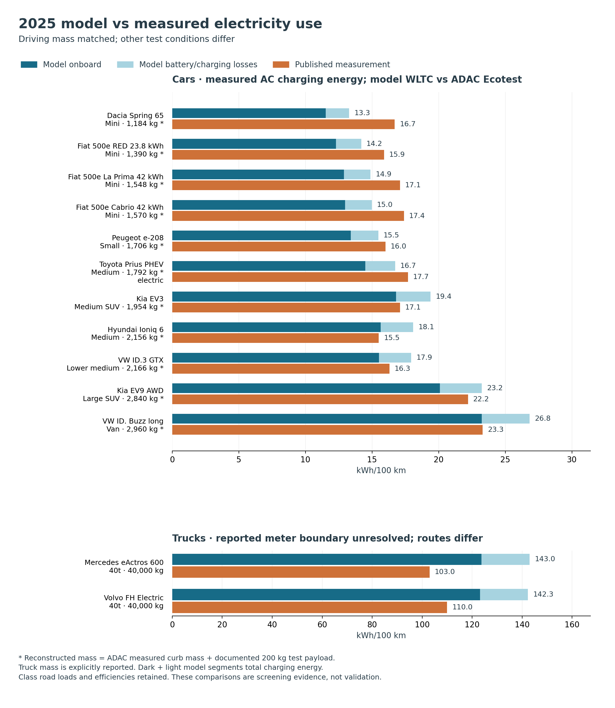

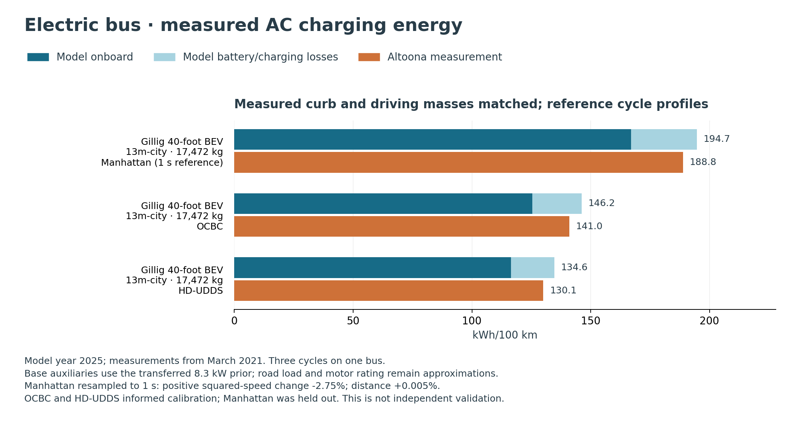

The Gillig comparisons with the generic motor rating now give 194.74, 146.22
and 134.64 kWh/100 km for Manhattan, OCBC and HD-UDDS, respectively, against
188.83, 140.99 and 130.05 measured (+3.1%, +3.7%, +3.5%). The two latter cycles
informed the auxiliary fit; Manhattan was withheld. The fit itself used the
source motor-rating bounds, so the generic-rating rerun is a transfer check.

Unknown-boundary BYD bus measurements have a separate screening panel in this
latest snapshot; earlier plots grouped them under an AC title incorrectly.

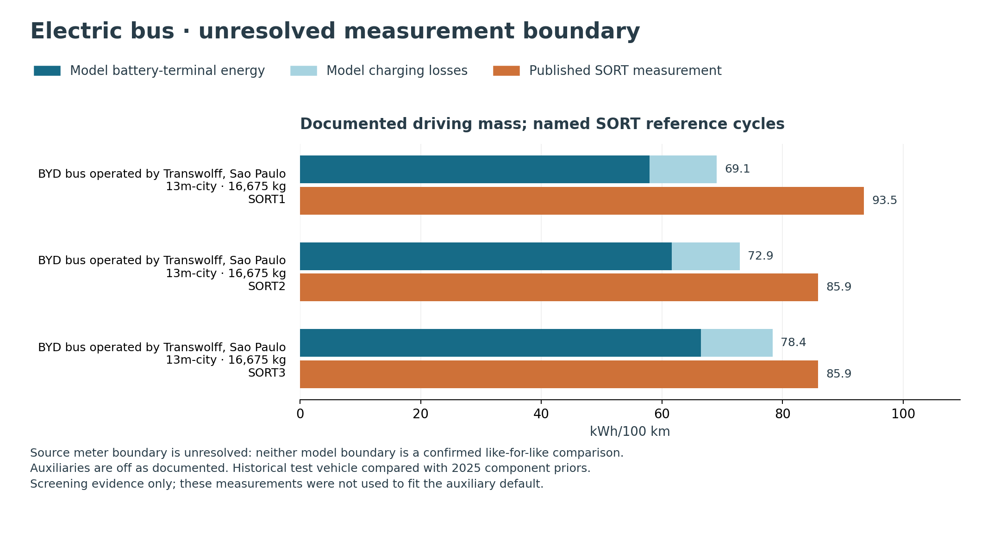

Native 2025 input set
---------------------

The four vehicle packages contain 1,147 native 2025 parameter records in total.
Most are interpolated or engineering priors, not fitted consumption parameters.
The consolidated exports retain units, uncertainty bounds, sources and comments.
The JSON also includes per-record provenance; package commits and file hashes
are provided separately. These exports are read-only views of the installed
input format, not alternative runtime defaults.

* :download:`2025 inputs (CSV) <_static/energy_validation_2025/defaults_2025/defaults_2025.csv>`
* :download:`2025 inputs and record provenance (JSON) <_static/energy_validation_2025/defaults_2025/defaults_2025.json>`
* :download:`Input file hashes and commits (JSON) <_static/energy_validation_2025/defaults_2025/provenance.json>`

Historical comparison snapshot before energy repairs
-----------------------------------------------------

The following results and figures document the earlier baseline. They are
retained to show the original findings and sources; their model values and
eligibility counts are superseded by the corrected snapshot above.

The expanded catalog contains **118 values from 35 datasets**, including
measurements for mini and small cars, compact cars, a sedan, SUVs, a van, buses
and heavy trucks. This is an ongoing collection. Multiple cycles and electrical
boundaries for the same vehicle do not count as independent vehicles.

The expanded runs complete **40 full 2025 model runs**, yielding
**37 eligible comparisons: 18 cars, six observations for four trucks,
and thirteen observations for four buses**.
The two electrical boundaries of the delivery truck share one model run.
Both the final stored mass
and the mass passed to the last energy calculation match the target within
0.1 kg. No consumption or efficiency is fitted to the observations.

Coverage and interpretation
~~~~~~~~~~~~~~~~~~~~~~~~~~~

.. list-table:: Historical source collection and usable model comparisons
   :header-rows: 1

   * - Vehicle type
     - Source datasets / values
     - Paired vehicles / values
     - Paired model sizes
   * - Cars
     - 20 / 67
     - 18 / 18
     - Eight classes, Mini through Large SUV and Van
   * - Buses
     - 8 / 30
     - 4 / 13
     - 13m-city
   * - Trucks
     - 7 / 21
     - 4 / 6
     - 7.5t and 40t

This is a diverse reference collection, not an exhaustive census. Repeated cycles,
phases and electrical boundaries do not increase the independent vehicle count.
All 118 observations have either a comparison or an explicit exclusion; 81 remain
unpaired. Missing mass/trace data, unsuitable mixed operating modes, suspect
source conditions, unsupported powertrains and zeroed model outputs are retained
as limitations rather than replaced with invented inputs. Further sources are
useful chiefly when they resolve these gaps or add a materially different class.

The artifact audit checks all 40 saved runs, source metadata fields, 54 model
source/data hashes, runner and cycle hashes, unit conversions, plotted observation
coverage and the exclusion partition. Maximum driving-mass discrepancy is
0.087 kg, including the mass supplied to the final energy calculation. This
verifies reproducibility and accounting, not the correctness of vehicle physics.
Ten earlier source records have URLs but no archived source-content hash;
these are listed in the downloadable audit.

Of 17 electricity comparisons, 14 use reported charging-inclusive measurements,
one uses battery-side energy, and two retain an unresolved meter boundary.
Eighteen car comparisons use WLTC versus Ecotest; two heavy-truck comparisons
use a generic route. The remaining 17 comparisons use named reference cycles,
with sampling and actual speed-tracking limitations documented per source.
A single pooled error statistic would conceal these differences.

The collection does **not establish fuel-consumption robustness**. The analytical
audit in :doc:`energy_validation_2025` reproduces nine defects or contract
inconsistencies among eleven targeted checks. Propulsion-input clipping,
auxiliary behavior at stops, recuperation and availability rules need correction
and independent regression checks before calibrating efficiency maps. Keep this
collection as the pre-correction reference, then rerun the same configurations
after fixes. Broader bus sizes, gas/fuel-cell trucks and exact Ecotest traces remain
research opportunities; they are not silently represented by different classes.

Figures
~~~~~~~

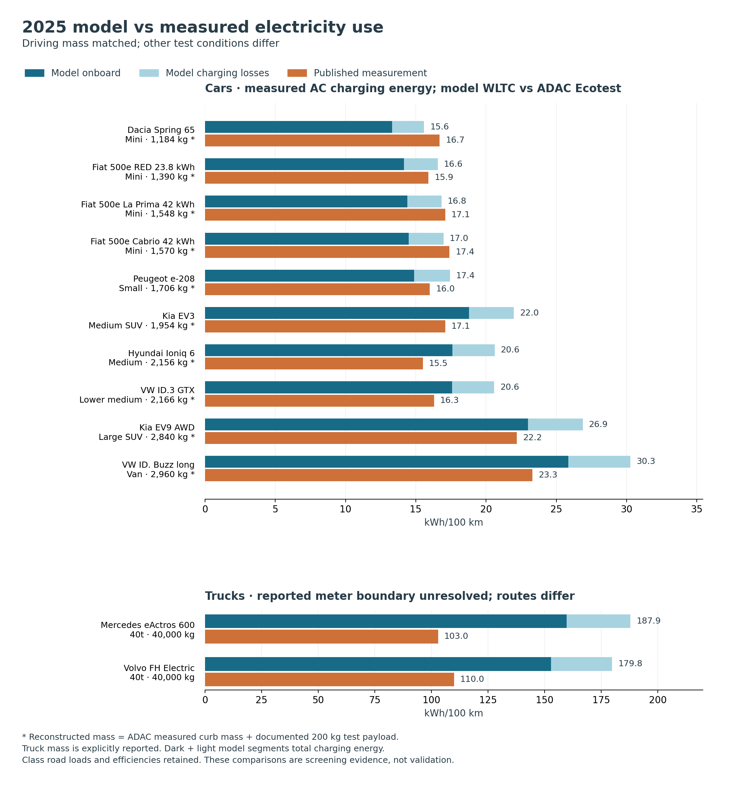

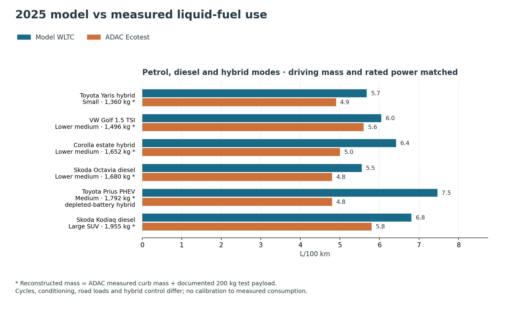

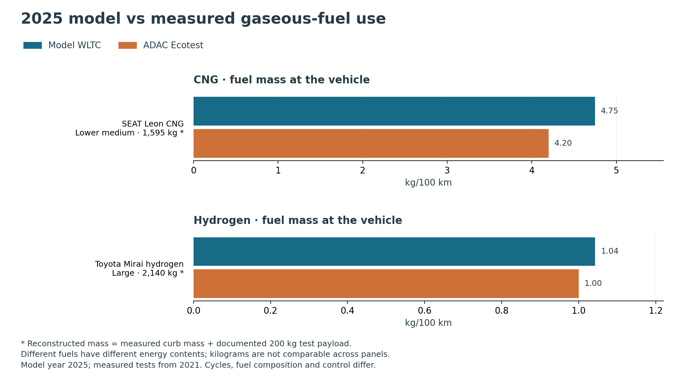

The second batch adds diesel, CNG and hydrogen, all with measured curb mass:

.. list-table:: Additional powertrains, at reconstructed driving mass
   :header-rows: 1
   :widths: 35 15 20 15 15

   * - Vehicle
     - Driving mass
     - Unit
     - Model WLTC
     - ADAC Ecotest
   * - Skoda Octavia Combi 2.0 TDI, 85 kW
     - 1,680 kg
     - L/100 km diesel
     - 5.55
     - 4.8
   * - SEAT Leon 1.5 TGI, 96 kW
     - 1,595 kg
     - kg/100 km CNG
     - 4.75
     - 4.2
   * - Toyota Mirai Executive, 134 kW
     - 2,140 kg
     - kg/100 km hydrogen
     - 1.04
     - 1.0

These are historical 2021 tests. The sources are the independent ADAC reports
for the `Octavia
<https://assets.adac.de/image/upload/Autodatenbank/Autotest/at6162-skoda-octavia-combi-20-tdi-scr-style-dsg/skoda-octavia-combi-20-tdi-scr-style-dsg.pdf>`_,
`Leon
<https://assets.adac.de/image/upload/Autodatenbank/Autotest/AT6134_SEAT_Leon_1_5_TGI_FR_DSG/SEAT_Leon_1_5_TGI_FR_DSG.pdf>`_
and `Mirai
<https://assets.adac.de/image/upload/v1635144662/ADAC-eV/KOR/Text/PDF/toyota-mirai-executive_bf1g0t.pdf>`_.
The gas values use fuel mass divided by modeled range, with an independent
check against fuel energy and lower heating value. They are not labelled as
litres or grid electricity. Mirai phase values are unavailable and are not
inferred. The Leon report's final-page phase row incorrectly labels litres;
its consumption prose explicitly labels the same values in kg CNG. The catalog
records this discrepancy and follows the prose.

For ADAC cars, the target is the measured curb mass plus the **200 kg payload**
specified in the `2019 Ecotest protocol, page 2
<https://www.adac.de/-/media/pdf/tet/ecotest/ecotest-methodik-ab-02-2019.pdf>`_.
This is a **documented reconstruction**, not an individually weighed driving
mass. The catalog preserves the formula, input values and protocol reference.
The model represents this load as one 75 kg occupant plus 125 kg of cargo.
Cars use the reported rated power and a corresponding size class; the EV3 uses
Medium SUV. Their reported electricity consumption includes AC charging losses.

The Mini class now also includes three independently reported Fiat variants:
`500e RED, 23.8 kWh
<https://assets.adac.de/image/upload/Autodatenbank/Autotest/at6353-fiat-500e-238-kwh-red/fiat-500e-238-kwh-red.pdf>`_,
`500e La Prima, 42 kWh
<https://assets.adac.de/image/upload/Autodatenbank/Autotest/at6342-fiat-500e-42-kwh-la-prima/fiat-500e-42-kwh-la-prima.pdf>`_
and `500e Cabrio Icon, 42 kWh
<https://assets.adac.de/image/upload/v1628669629/ADAC-eV/KOR/Text/PDF/Fiat_500e_Cabrio_Icon_i33k5k.pdf>`_.
Their reconstructed driving masses are 1,390, 1,548 and 1,570 kg, respectively.
Combined measured AC consumption is 15.9, 17.1 and 17.4 kWh/100 km.
The reports date from November 2023, October 2023 and August 2021.
Nine additional phase values are catalogued separately and are not paired with
combined WLTC outputs. Battery sizes identify the variants; the model retains
class battery sizing and road load while matching mass and rated power.

Plug-in-hybrid operating modes
~~~~~~~~~~~~~~~~~~~~~~~~~~~~~~

The `January 2024 Prius plug-in-hybrid test
<https://assets.adac.de/image/upload/Autodatenbank/Autotest/at6367-toyota-prius-20-plug-in-hybrid-advanced/toyota-prius-20-plug-in-hybrid-advanced.pdf>`_
reports 17.7 kWh/100 km including charging losses in electric mode and
4.8 L/100 km with the battery depleted. Separate full 2025 runs retain the
``PHEV-e`` and ``PHEV-c-p`` modes using ``drop_hybrids=False``. Both use a
reconstructed driving mass of 1,792 kg and the documented 13.6 kWh battery.
Electric mode uses the 120 kW motor rating; hybrid mode uses the 164 kW system
rating with the model's default power split. This does not reproduce the actual
hybrid controller or battery state trajectory.

The depleted-mode model gives 7.47 L/100 km on WLTC and is labeled explicitly
in the fuel figure. The electric-mode run is excluded: the car model's final
``range < 100 km`` rule zeros its ``TtW energy``, while leaving charging
consumption at 18.8 kWh/100 km. This is an inconsistent full-model output,
not a valid electric-mode comparison. The benchmark preserves that rule and
records the exclusion. The hybrid-mode model also retains its default combustion
power share; it does not reproduce the Prius power-split drivetrain.
Three fuel phase values
and the paired electricity/fuel quantities for the first 100 km starting fully
charged remain unpaired. The mixed-trip results must not be compared with either
single mode or with a generic electric utility factor.

The trucks have an explicitly reported **40,000 kg** driving mass. Model inputs
also use the published battery and continuous power specifications: 621 kWh and
400 kW for the eActros, 540 kWh and 490 kW for the Volvo. The 40t model class uses
the documented 44 t permissible combination mass, which is distinct from actual
driving mass. The eActros series specification is a proxy for the near-series
prototype; Volvo's test release does not qualify its capacity as gross or usable.
Both sources and the relevant specification documents are linked in the catalog.

**Matching mass is not validation.** ADAC Ecotest combines tests differently
from the model's WLTC. The truck road routes differ from the generic Long haul
trace, and their exact electrical meter boundaries remain unresolved. Road load,
control, battery chemistry and efficiencies still largely use class defaults.
Truck error percentages are therefore not reported against a guessed boundary.
Historical measurements keep their actual publication/test dates while every
model run uses interpolated 2025 inputs.

Delivery truck with paired electrical boundaries
~~~~~~~~~~~~~~~~~~~~~~~~~~~~~~~~~~~~~~~~~~~~~~~~

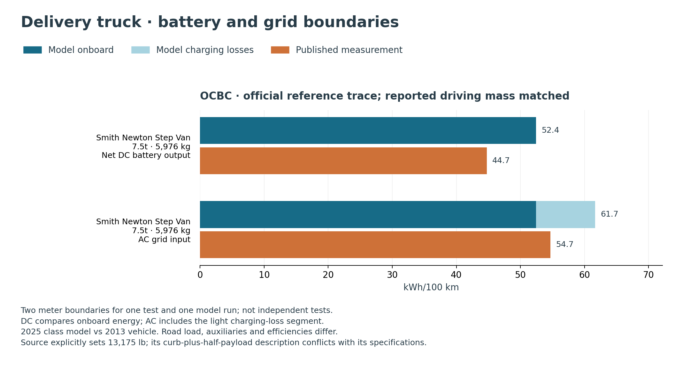

The `CALSTART / California Energy Commission report
<https://calstart.org/wp-content/uploads/2018/10/Battery-Electric-Parcel-Delivery-Truck-Testing-and-Demonstration.pdf>`_
adds six values. Only its OCBC pair is modeled; the remaining cycle profiles
are pending. The catalog records a discrepancy between the explicit dynamometer
mass and its descriptive formula. The explicit setting is used.

The `official DriveCAT trace
<https://nrel.sitefinity.cloud/transportation/drive-cycle-tool>`_ has 1,910 samples,
10.526 km and a 40.63 mph maximum, consistent with the report's cycle metrics.
The local adapter replaces only the energy-model trace; constructor defaults
retain Urban delivery. Full sizing uses the published battery capacity, power
and permissible mass. CSV conversion and source hashes are retained in
``expanded/cycles/``. Model auxiliaries remain at their class default (3.113 kW),
so the test's cabin settings are not reproduced. These historical measurements
do not directly validate 2025 technology or default road load and efficiencies.

Diesel delivery truck and gasoline-hybrid evidence
~~~~~~~~~~~~~~~~~~~~~~~~~~~~~~~~~~~~~~~~~~~~~~~~~~

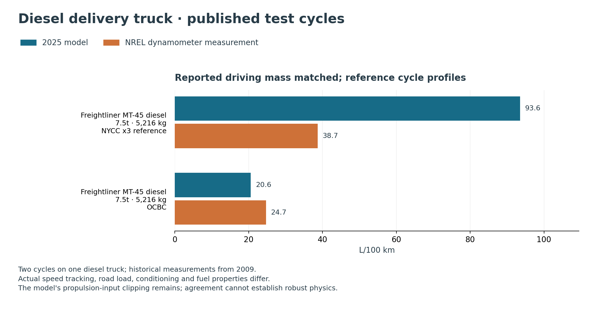

The `NREL FedEx evaluation
<https://docs.nlr.gov/docs/fy11osti/48896.pdf>`_ supplies six cycle means for a
diesel MT-45 and gasoline-hybrid E-450, with explicit dynamometer masses and
individual repeat results. The catalog preserves actual fuel-volume mpg,
separately from the source's diesel-equivalent gasoline values. Converting a
reported mean mpg to L/100 km is not the same as averaging inverse replicates.

The diesel model uses the 7.5t class, the reported 5,216 kg driving mass and
200 hp engine rating. OCBC uses the retained reference trace; NYCC repeats the
official reference three times, sharing zero-speed endpoints. Actual tracking
and conditioning are unavailable. The two runs produce 20.6 and 93.6 L/100 km,
respectively. The model removes about 19% and 79% of motive-input energy through
its existing power clipping. The large NYCC discrepancy remains in the plot;
finite, available model output does not establish physical validity.

HTUF4 awaits its trace. The three gasoline-hybrid measurements remain unpaired:
the truck package has no ``HEV-p`` implementation, and a diesel hybrid would
represent a different powertrain. Historical test dates are retained.

Electric bus with documented curb and seated-load weights
~~~~~~~~~~~~~~~~~~~~~~~~~~~~~~~~~~~~~~~~~~~~~~~~~~~~~~~~~~

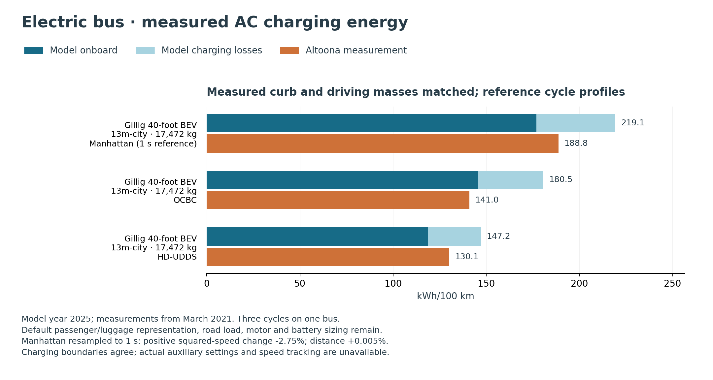

The `Gillig Altoona test record
<https://www.altoonabustest.psu.edu/bus-details.aspx?BN=2020-05>`_ identifies the
vehicle. The report is available inside `PSTA's procurement submission
<https://psta.net/wp-content/uploads/2025/11/gillig-technical-qualifications-no-price.pdf>`_
(report pp9, 85–87 and 92; PDF page251 contains the energy table).
Its March 2021 results explicitly use AC energy entering the charger during
recharge. All three published cycles are compared using reference traces;
Manhattan uses a documented one-second resampling of its 10 Hz reference.

The three modeled cycles use a 13m-city depot-charged bus with measured curb mass
14,737.2 kg, seated-load driving mass 17,472.4 kg and temperature 24 °C.
Both stored and energy-input driving masses agree within 0.1 kg. Unlike the
earlier BYD runs, this known curb mass avoids assigning vehicle structure to
passenger load. The model's passenger/luggage split still represents aggregate
load, not the actual seated/wheelchair arrangement. Battery sizing, motor rating,
road load and auxiliary settings remain class assumptions. The documented
444 kWh capacity is metadata, not an effective bus capacity override.

These runs retain motive-input clipping of about 9% on Manhattan, 5% on OCBC
and 14% on HD-UDDS.
Eligibility means finite positive output with the availability checks satisfied;
it does not mean the model is validated. Earlier BYD exclusions remain below.

Historical diesel and hybrid buses
~~~~~~~~~~~~~~~~~~~~~~~~~~~~~~~~~~

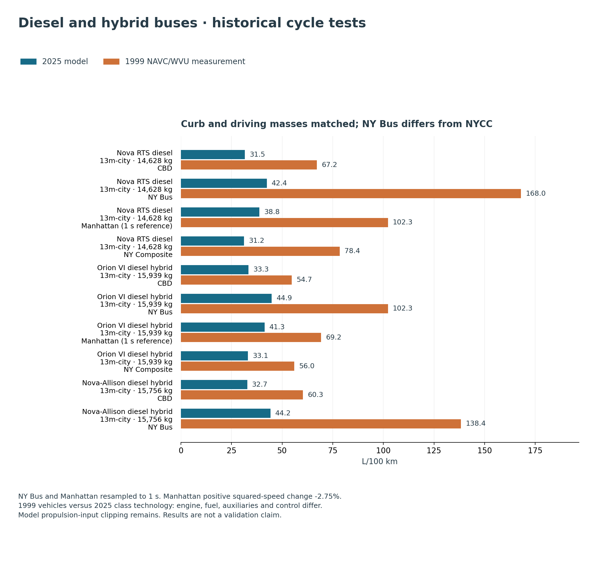

`TCRP Report 59, Tables 6.2 and 6.3
<https://onlinepubs.trb.org/onlinepubs/tcrp/tcrp_rpt_59.pdf>`_ provides ten
diesel-consumption values for three buses tested in 1999. These are historical
technology comparisons, not measurements representative of 2025 vehicles.
Ten full model runs use CBD, Manhattan, NY Bus and NY Composite references
and the reported curb and test masses.
Fuel economy was estimated by carbon balance. The report's CNG diesel-equivalent
mpg and synthetic-fuel/control variants remain separate research leads.

The official NY Bus reference has 6,001 samples at 10 Hz. Resampling at integer
seconds gives 601 samples over 600 seconds. Distance (0.61478 miles), maximum
speed and total positive change in squared speed are preserved; reconstructing
the finer trace from the one-second values differs by at most 0.04 mph. The
conversion and checks are saved with the cycle. NY Bus, NY Composite and NYCC
are distinct cycles and are not substituted for one another.

The CBD reference already contains one-second samples (561 samples,
560 seconds elapsed, 2.04556 miles). Manhattan is interpolated from 10 Hz to
1,090 samples at whole seconds, omitting only a stopped final 0.1 second.
Distance increases by 0.00538%, peak speed decreases from 25.4 to 25.2 mph,
and total positive change in squared speed decreases by 2.75029%. These
checks quantify sampling differences; they do not establish equivalent
acceleration or energy demand. Manhattan results are labeled as a one-second
reference in the figures and carry a sampling note in the comparison table.

The ten modeled fuel values lie below the historical measurements. Default
road load, accessories, drivetrain and fuel properties remain unmatched, and
propulsion-input clipping removes about 24–45% of calculated motive input.
The direction of the discrepancy is not evidence of improvement in 2025
technology: these factors prevent attributing the difference to a single cause.

Bus exclusions and numerical findings
~~~~~~~~~~~~~~~~~~~~~~~~~~~~~~~~~~~~~~

The three BYD SORT tests report 16,675 kg and auxiliaries off. Full model runs
reach that mass, but representing the added load as passengers triggers a later
rule reserving capacity for **50% extra passengers**. The bus model then zeros
``TtW energy`` while leaving nonzero charging consumption and availability flags.
The finite cycle energy is insufficient to qualify these full-model outputs:
the three comparisons are excluded from the figures. Resolving the measured
curb mass and passenger/ballast split is needed before treating the model load
as representative of this bus test.

The benchmark runner tightens sizing convergence to ``rtol=1e-8`` locally and
records the mass supplied to the physics, rather than relying on final mass
alone. Production physics and availability rules are unchanged. Its truck
payload adjustment uses the requested payload, avoiding an oscillation caused
by feeding back an already clipped payload. A generic 800 km battery-sizing
probe still failed tight convergence; the plotted truck cases instead use the
published capacities and complete successfully.

The original audit's propulsion-input clipping issue remains: this batch records
roughly 18–25% removed motive-input energy for the three petrol/hybrid cases.
The added diesel and CNG cases record approximately 34% removed input energy.
Apparent agreement with a measured fuel value cannot establish robust physics.
The per-case diagnostics are included in ``runs.json`` and ``comparisons.csv``.

Additional evidence awaiting matched runs
~~~~~~~~~~~~~~~~~~~~~~~~~~~~~~~~~~~~~~~~~

The catalog also preserves six individual `Green NCAP Tesla Model 3 tests
<https://www.greenncap.com/assessments/tesla-model-3-2024-0211/>`_ at both grid and
battery-output boundaries: twelve values, not twelve independent tests. Raw ODS
numbers, displayed precision, source cells and the spreadsheet hash are retained.
The published 1,763 kg is a curb-mass specification, not test driving mass.
Green NCAP uses a different loading protocol; the ADAC 200 kg reconstruction
does not apply. These observations remain unpaired until the appropriate test
mass is established. Phase results, fleet temperature bins, route-day extrema
and relative winter changes also remain separate from combined comparisons.

The `CALSTART FCCC MT E-Cell road tests
<https://calstart.org/wp-content/uploads/2018/10/Battery-Electric-Parcel-Delivery-Truck-Testing-and-Demonstration.pdf>`_
add three AC observations: 0.99 and
1.20 kWh/mile on the Urban Pomona Loop at minimum and maximum load, and
1.19 kWh/mile on the delivery route (main Table 3-3). Appendix A establishes
that these include charging losses through bulk recharge but exclude subsequent
260–300 W plugged-in standby. It reports no DC measurements. The maximum
load reconstructs to 6,341.2 kg from 9,460 lb curb plus 4,520 lb payload; curb
uncertainty is ±80 lb and payload precision is unspecified. Minimum-load driver
and equipment mass is unquantified. No numerical road speed/grade trace is
available, so all three remain unpaired. Appendix Table 5-6 prints 1.15 rather
than 1.19 kWh/mile; its 67.36 kWh divided by corrected distance 56.5 miles
supports the main-table value. Both values and the discrepancy are retained.

Five April 2025 hydrogen-bus observations come from the `Schatz Center
Humboldt XHE40 report
<https://schatzcenter.org/pubs/2025-Xcelsior-PerformanceReport-SchatzCenter.pdf>`_.
The nominal driving masses reconstruct from measured curb mass and each
test’s passenger/ballast load. Hydrogen use is inferred from tank pressure at
20 °C, with approximately two-significant-figure precision. Published fuel
economies correct net battery SOC changes where needed. These hilly road
tests lack complete numerical speed/gradient traces and remain unpaired;
HVAC also differs between the light and loaded Trinidad–Scotia tests.

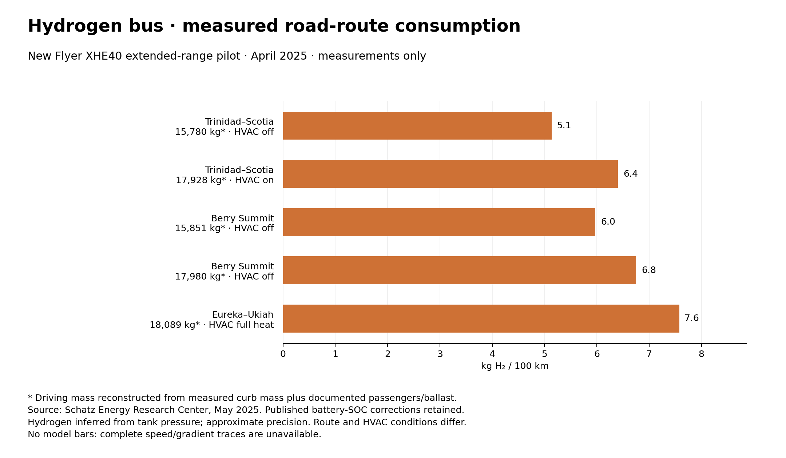

The articulated New Flyer XHE60 adds three reported hydrogen-consumption
values from `FTA Report 0230
<https://rosap.ntl.bts.gov/view/dot/64117/dot_64117_DS1.pdf>`_: 4.8 mile/kg
on CBD, 7.4 on its commuter test and 4.6 in demonstration service.
These correspond to 12.9, 8.4 and 13.5 kg/100 km. The summary report lacks
the test mass and battery-energy correction, and the original Altoona 1615
report download currently fails. These values remain unpaired. All 63 daily
appendix entries match mileage divided by 4.6 to the stated 0.1 kg rounding, so they
are not counted as independent measurements.

The October 2024 `ADAC Kodiaq diesel report
<https://assets.adac.de/image/upload/Autodatenbank/Autotest/at6414-skoda-kodiaq-20-tdi-selection-dsg/skoda-kodiaq-20-tdi-selection-dsg.pdf>`_
adds a larger combustion SUV: measured curb mass 1,755 kg, reconstructed
driving mass 1,955 kg, power 110 kW and combined consumption 5.8 L/100 km.
The 2025 Large SUV model uses 6.81 L/100 km versus the measured 5.8.
Both stored and energy-input mass agree within 0.1 kg. Propulsion-input
clipping removes 31.1% of calculated motive input. Size mapping is approximate
and model WLTC differs from Ecotest; this is not a validation pass.
The December 2024 `Duster hybrid report
<https://assets.adac.de/image/upload/Autodatenbank/Autotest/at6428-dacia-duster-hybrid-140-extreme/dacia-duster-hybrid-140-extreme.pdf>`_
provides four further values but lists faulty lambda sensors and an overly rich
mixture. The timing of the fault or repair relative to consumption measurement
is unclear. These observations are retained with that quality flag and excluded
from comparisons of normally functioning vehicles.

Further collection priorities are more diesel, CNG and fuel-cell sizes, plug-in-hybrid cars,
and additional bus and truck sizes/powertrains with documented test loads. The
research backlog is saved in the expanded catalog.

Downloads and reproduction
~~~~~~~~~~~~~~~~~~~~~~~~~~~~

* :download:`Coverage and consistency audit (JSON) <_static/energy_validation_2025/expanded/coverage_audit.json>`
* :download:`Expanded source catalog (JSON) <_static/energy_validation_2025/expanded/measurements.json>`
* :download:`All expanded observations (CSV) <_static/energy_validation_2025/expanded/measurements.csv>`
* :download:`Hydrogen-bus measurements only (PDF) <_static/energy_validation_2025/expanded/hydrogen_bus_measurements.pdf>`
* :download:`All seven updated figures (PDF) <_static/energy_validation_2025/expanded/mass_comparison_bars.pdf>`
* :download:`Electricity figure (SVG) <_static/energy_validation_2025/expanded/electricity_mass_comparison.svg>`
* :download:`Fuel figure (SVG) <_static/energy_validation_2025/expanded/fuel_mass_comparison.svg>`
* :download:`Gaseous-fuel figure (SVG) <_static/energy_validation_2025/expanded/gas_mass_comparison.svg>`
* :download:`Delivery-truck figure (SVG) <_static/energy_validation_2025/expanded/delivery_truck_mass_comparison.svg>`
* :download:`Diesel-truck figure (SVG) <_static/energy_validation_2025/expanded/diesel_truck_mass_comparison.svg>`
* :download:`Bus figure (SVG) <_static/energy_validation_2025/expanded/bus_mass_comparison.svg>`
* :download:`Diesel/hybrid bus figure (SVG) <_static/energy_validation_2025/expanded/fuel_bus_mass_comparison.svg>`
* :download:`OCBC trace (CSV) <_static/energy_validation_2025/expanded/cycles/ocbc.csv>`
* :download:`OCBC provenance (JSON) <_static/energy_validation_2025/expanded/cycles/ocbc_provenance.json>`
* :download:`NYCC repeated reference (CSV) <_static/energy_validation_2025/expanded/cycles/nycc_x3.csv>`
* :download:`NYCC provenance (JSON) <_static/energy_validation_2025/expanded/cycles/nycc_x3_provenance.json>`
* :download:`HD-UDDS reference (CSV) <_static/energy_validation_2025/expanded/cycles/udds_hd.csv>`
* :download:`HD-UDDS provenance (JSON) <_static/energy_validation_2025/expanded/cycles/udds_hd_provenance.json>`
* :download:`Manhattan sampling provenance (JSON) <_static/energy_validation_2025/expanded/cycles/manhattan_provenance.json>`
* :download:`CBD sampling provenance (JSON) <_static/energy_validation_2025/expanded/cycles/cbd_provenance.json>`
* :download:`Paired values, masses and sources (CSV) <_static/energy_validation_2025/expanded/comparisons.csv>`
* :download:`Comparison manifest and exclusions (JSON) <_static/energy_validation_2025/expanded/comparisons.json>`
* :download:`Full model outputs (JSON) <_static/energy_validation_2025/expanded/runs.json>`
* :download:`Runtime and input hashes (JSON) <_static/energy_validation_2025/expanded/provenance.json>`
* :download:`Plot input hash and observation IDs (JSON) <_static/energy_validation_2025/expanded/plot_manifest.json>`

In the Python 3.12 environment with the matching vehicle packages installed::

    python scripts/validate_energy_measurements.py --output /tmp/energy-expanded

Copy the resulting CSV/JSON files into the expanded documentation data folder,
then use an environment containing Matplotlib::

    python scripts/plot_energy_mass_comparisons.py
    python scripts/plot_hydrogen_bus_measurements.py
    python scripts/audit_energy_measurements.py

To reproduce conversion of a downloaded DriveCAT seconds/mph reference::

    python scripts/prepare_energy_cycle.py source.csv converted.csv --source-url SOURCE_URL

The converter writes the one-second km/h trace and a provenance JSON with
source hashes, distance, speed and sampling diagnostics. It rejects nonuniform
timestamps, negative speeds and moving endpoints.

Earlier catalog and generic comparisons
----------------------------------------

The earlier catalog contains **24 absolute consumption values and two relative winter
comparisons from 10 datasets**: 16 absolute electric values, eight fuel values,
and two electric winter comparisons. Subcycles, temperature bins and route days
share a dataset identifier; they are not independent vehicle tests.

These are reported measurements, with source type and access limitations retained.
They supplement the original audit. The charts in this earlier section reuse
its saved runs; the mass-matched reruns are above. Test dates span 2020–2025 where known. Earlier observations
remain historical checks rather than measurements of a 2025 vehicle.

Downloads:

* :download:`Structured catalog with conditions and provenance <_static/energy_validation_2025/additional_measurements.json>`
* :download:`Flat observation table (CSV) <_static/energy_validation_2025/additional_measurements.csv>`

Model comparison bar charts
---------------------------

The figures pair **16 published results with saved 2025 model runs**: six
references from the original audit and ten observations from this catalog.
Model runs are reused when several references share a model class; there are
11 distinct saved runs in the plots. Values come directly from the recorded
outputs, without rerunning or calibrating the model.

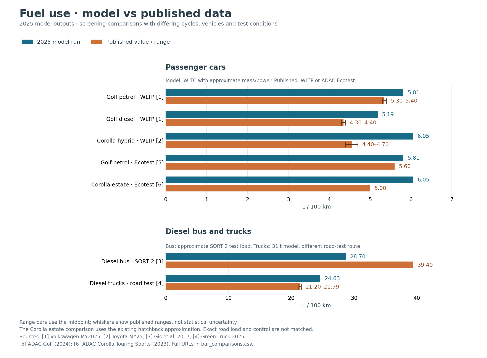

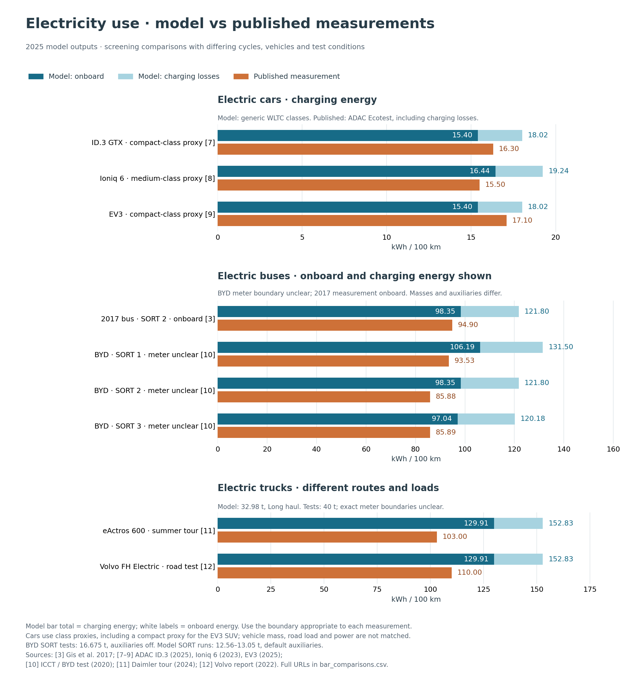

These are class and specification approximations. In particular, the electric
cars use generic Lower medium or Medium classes, including a compact-class proxy
for the EV3 SUV. The BYD test load is 16.675 t with auxiliaries off; the plotted
13 m bus models weigh 12.56–13.05 t and retain default auxiliaries. The electric
truck model weighs 32.98 t, versus 40 t in the road tests, and follows a different
route. The Corolla estate uses the audit's existing hatchback approximation.

For electricity, the dark segment is modeled onboard consumption and the light
segment adds charging losses. The total is charging energy. ADAC car values
include those losses; the 2017 bus observation is onboard. The BYD and electric
truck sources do not establish an exact meter boundary, so both model boundaries
remain visible without assigning a single prediction-error percentage. For fuel
ranges, the published bar ends at the midpoint and whiskers show the full range;
they do not represent statistical uncertainty.

Six ADAC phase values, six fleet temperature bins, two individual truck route
days and two relative winter percentages have no corresponding saved model run
with comparable scope. They remain in the catalog and are explicitly listed as
unpaired in the downloadable plot manifest.

* :download:`Both figures as a two-page PDF <_static/energy_validation_2025/model_vs_measurements_bars.pdf>`
* :download:`Plotted values, model cases and source URLs (CSV) <_static/energy_validation_2025/bar_comparisons.csv>`
* :download:`Plot manifest, source hashes and exclusions (JSON) <_static/energy_validation_2025/bar_comparisons.json>`
* :download:`Editable fuel figure (SVG) <_static/energy_validation_2025/fuel_comparison_bars.svg>`
* :download:`Editable electricity figure (SVG) <_static/energy_validation_2025/electricity_comparison_bars.svg>`

Regenerate from the repository root in an environment with Matplotlib installed::

    python scripts/plot_energy_measurements.py

Electric cars: a clear charging boundary
----------------------------------------

.. list-table:: Independent ADAC measurements
   :header-rows: 1
   :widths: 38 16 20 26

   * - Vehicle
     - kWh/100 km
     - Date
     - Source
   * - VW ID.3 GTX, 210 kW
     - 16.3
     - Report July 2025
     - `ID.3 test report <https://assets.adac.de/image/upload/Autodatenbank/Autotest/at6499-vw-id3-gtx/vw-id3-gtx.pdf>`_
   * - Hyundai Ioniq 6, 77.4 kWh, UNIQ 2WD
     - 15.5
     - Report May 2023
     - `Ioniq 6 test report <https://assets.adac.de/image/upload/Autodatenbank/Autotest/at6302-hyundai-ioniq-6-774-kwh-uniq-paket-2wd/hyundai-ioniq-6-774-kwh-uniq-paket-2wd.pdf>`_
   * - Kia EV3, 58.3 kWh, Earth
     - 17.1
     - Ecotest February 2025
     - `EV3 measured results <https://www.adac.de/rund-ums-fahrzeug/autokatalog/marken-modelle/kia/ev3/sv1/336657/>`_

All three values include charging losses. The EV3 catalog separately dates its
Autotest summary June 2025 and its PDF May 2025; the recorded Ecotest date is
February. These are different date fields, not three independent tests.

The applicable `ADAC protocol <https://www.adac.de/-/media/pdf/tet/ecotest/ecotest-methodik-ab-02-2019.pdf>`_
uses modified WLTC and additional motorway testing for BEVs, with a general
200 kg payload requirement, air conditioning and lights. These conditions are
protocol-level information, not vehicle-specific test logs.

For the model, the appropriate candidate output is charging-boundary
``electricity consumption * 100``, after checking its loss definition.
The existing plain-WLTC runs cannot be directly scored against Ecotest combined
values. Matching measured curb mass alone also does not establish test mass or
road load.

Fuel cars: measured phase differences
-------------------------------------

.. list-table:: ADAC Ecotest consumption, L/100 km
   :header-rows: 1
   :widths: 36 16 12 12 12 12

   * - Vehicle
     - Ecotest date
     - Combined
     - Urban
     - Rural
     - Motorway
   * - Golf 1.5 TSI Life, 85 kW, manual
     - December 2024
     - 5.6
     - 5.9
     - 5.0
     - 6.3
   * - Corolla Touring Sports 1.8 Hybrid, 103 kW
     - April 2023
     - 5.0
     - 3.6
     - 4.6
     - 6.8

Sources: `Golf measured results <https://www.adac.de/rund-ums-fahrzeug/autokatalog/marken-modelle/vw/golf/viii-facelift/332971/>`_
and `Corolla measured results <https://www.adac.de/rund-ums-fahrzeug/autokatalog/marken-modelle/toyota/corolla/e21-facelift/325908/>`_.

The Corolla is an estate, whereas the original audit used a hatchback reference.
Its strong urban-to-motorway difference makes phase-specific hybrid operation a
useful next diagnostic. Do not average the three component numbers to reconstruct
the combined value: use the test's actual distances, conditioning and weighting.

Electric buses: controlled cycles and fleet operation
-----------------------------------------------------

The `ICCT report, Appendix II, Table 7 <https://theicct.org/wp-content/uploads/2023/02/Operational-analyis-of-battery-electric-buses-in-Sao-Paulo-final-feb2023.pdf>`_
reproduces a September 2020 BYD/Transwolff test in São Paulo.
Loaded mass was **16,675 kg**, with half passenger capacity and auxiliaries,
including air conditioning, off.

.. list-table:: Same bus, three SORT cycles
   :header-rows: 1
   :widths: 25 35 40

   * - Cycle
     - Reported kWh/km
     - Converted kWh/100 km
   * - SORT 1
     - 0.9353
     - 93.53
   * - SORT 2
     - 0.8588
     - 85.88
   * - SORT 3
     - 0.8589
     - 85.89

The full table and adjacent method were available through the search index;
direct PDF access returned HTTP 403. The retrieved passage does not establish the
electrical meter boundary or exact bus variant. Those must be resolved before
choosing between model onboard and charging energy. The bundled SORT traces also
need their distance and stop treatment checked, as discussed in the audit.

A separate `Győr fleet study, Table 1 <https://www.mdpi.com/2071-1050/16/18/8182>`_
reports 2024 observations from 13 BYD K9UD buses:

.. list-table:: Fleet consumption by ambient-temperature bin
   :header-rows: 1
   :widths: 50 50

   * - Temperature, °C
     - kWh/100 km
   * - −5 to 0
     - 116.73
   * - 0 to 5
     - 106.17
   * - 5 to 10
     - 90.33
   * - 10 to 15
     - 80.90
   * - 15 to 20
     - 70.05
   * - 20 to 25
     - 78.86

These are charge-derived FleetLink records. Precise AC/DC accounting and
auxiliary-heater fuel treatment remain unclear. Grid preheating, charging
frequency, routes and drivers can affect the values. The bins describe a fleet
association, not a controlled temperature experiment or an isolated HVAC curve.

Electric trucks: loaded road measurements
------------------------------------------

.. list-table:: Reported road-test electricity consumption
   :header-rows: 1
   :widths: 30 16 20 34

   * - Vehicle / observation
     - kWh/100 km
     - Gross mass
     - Conditions
   * - eActros 600, summer tour mean
     - 103
     - 40 t
     - 15,269 km; efficiency-oriented prototype and driving
   * - Same truck, Madrid–Bilbao day
     - 85
     - 40 t
     - About 360 km; favorable weather and downhill terrain
   * - Same truck, Alta–North Cape day
     - 140
     - 40 t
     - About 240 km; partly unpaved; minimum 7 °C
   * - Volvo FH Electric, Green Truck route
     - 110
     - 40 t
     - 343 km; reported mean speed 80 km/h

Sources: `Daimler's 2024 instrumented tour <https://www.daimlertruck.com/en/newsroom/events/2024/eactros-600-european-testing-tour-2024>`_
and `Volvo's January 2022 report of a journalist test <https://www.volvotrucks.com/en-en/news-stories/press-releases/2022/jan/volvos-heavy-duty-electric-truck-is-put-to-the-test-excels-in-both-range-and-energy-efficiency.html>`_.

These are manufacturer-published results; the Volvo source describes a journalist
test. Exact electrical meter definitions are not supplied in the reviewed
summaries. The two eActros days are components of the tour, not independent tests
or confidence bounds on its mean. None uses the bundled VECTO Long haul trace.

`Daimler's winter 2025 comparison <https://www.daimlertruck.com/en/newsroom/pressrelease/eactros-600-european-tour-in-snow-and-ice-electric-trucks-also-drive-efficiently-in-winter-52999553>`_
reports approximately **25% higher consumption** on snow-free roads at an average
−2 °C with cold starts, cabin heating to 21 °C and class B rather than summer
class A tires. The increase approached **50%** with snow/ice and class D tires.
These are relative comparisons against corresponding summer sections. They do
not isolate temperature, and multiplying the tour-wide 103 kWh/100 km by these
percentages would invent an absolute winter measurement.

How to use the expanded evidence
--------------------------------

1. **Prioritize the three SORT bus cycles** once the meter boundary and bus
   specification are resolved. A shared vehicle, known load and auxiliaries-off
   condition make the cycle differences useful for checking traction and
   regeneration.
2. **Reproduce Ecotest conditions for the three BEV cars.** Match variant, road
   load, test mass, auxiliaries and charging losses. The quoted figures provide
   clearer energy boundaries than most road-test press releases.
3. **Use the Golf and Corolla phase data to examine hybrid behavior.** Match
   cold/warm conditioning and charge balance before interpreting model errors.
4. **Use loaded trucks and bus weather bins as plausibility checks.** Obtain
   route traces and meter definitions before assigning prediction-error
   thresholds or tuning efficiency parameters.

The existing analytical defects still need correction before calibration.
Agreement with an unmatched fleet or route average cannot resolve a power-balance
error.

Catalog conventions
-------------------

The JSON is the canonical catalog. Each observation references one dataset with
its source URL, locator, source type, dates, conditions, meter boundary and missing
information. The CSV expands those dataset fields onto every observation row;
nested values are JSON-encoded inside quoted CSV fields. Observation-specific
fields take precedence if a name overlaps.

Unknown values are null in JSON and blank in CSV. Values retain the source's
reported precision without implying a statistical uncertainty. Percentage records
must be filtered by ``measure_type`` and their ``value_qualifier`` retained.
For example, the numeric 50 with qualifier “almost” is not an exact 50% result.
The only absolute unit conversion here is kWh/km multiplied by 100.

Reproducing the current comparison
-----------------------------------

Use Python 3.12 with matching editable installs of all five repositories and
Matplotlib. Run the following from the shared repository, using a fresh output
directory. The runner records package commits and file hashes; the catalog
copy lets the independent audit verify the exact evidence used::

    python scripts/validate_energy_measurements.py \
        --catalog docs/_static/energy_validation_2025/expanded/measurements.json \
        --output /tmp/energy-comparison
    cp docs/_static/energy_validation_2025/expanded/measurements.json /tmp/energy-comparison/
    python scripts/plot_energy_mass_comparisons.py --data /tmp/energy-comparison
    python scripts/audit_energy_measurements.py --data /tmp/energy-comparison --recorded-commits

The recorded-commit audit assumes production source and input changes are
committed. Regenerate the consolidated native inputs with::

    python scripts/export_2025_defaults.py --output /tmp/energy-defaults-2025
