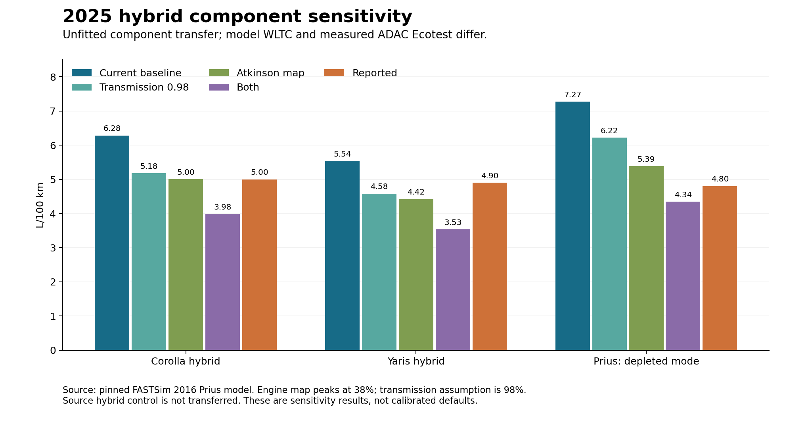

Energy-model repairs and 2025 calibration
=========================================

Physical consistency takes precedence over a fixed error target. This review
repairs the identified energy-accounting and source-cycle defects and supplies
native 2025 inputs for cars, buses, trucks and two-wheelers. Only the city-bus
auxiliary prior is consumption-fitted; other component priors are sourced or
explicit engineering assumptions. This is not universal empirical validation.

For the final 40-run, 41-comparison snapshot, downloadable bar charts and the
consolidated 1,147-record input set, see :doc:`energy_measurements`. Sections
below retain the investigation history; the final adopted priors and installed
verification at the end supersede earlier intermediate results.

Corrected mechanics and input contracts
---------------------------------------

* Engine load uses shaft output, including combustion auxiliary loads, divided
  by rated shaft power. Transmission-map dependence is solved per sample with
  bounded, damped iteration. Exact zero-load cells remain zero.
* Fuel/electrical input is no longer clipped at the mechanical engine rating.
  ``EnergyConsumptionModel.power_deficit_kw`` reports requested shaft demand
  exceeding that rating; the requested trace is not silently made feasible.
* Explicit efficiency inputs take precedence over maps. Zero recuperation
  efficiency disables recovery. Nonfinite or negative mass, road load, power and
  battery-efficiency inputs are rejected. Nonfinite energy outputs raise an error
  instead of being replaced with zeros.
  Public ``engine_efficiency`` and ``transmission_efficiency`` dictionaries now
  reach the energy calculation in every family. Keys are
  ``(powertrain, size, year)``; values are scalars or one value per sample in
  ``(0, 1]``. Partial overrides preserve the other vehicles' default maps.
* Auxiliary demand continues during intermediate stops and through the final
  moving second. Every supplied custom-cycle sample now counts as operating time, including
  terminal stops. Named car cycles now use their explicit NaN padding boundary, so terminal
  stops consume auxiliary energy. Bus, truck and two-wheeler resource duration
  metadata remains to be resolved.
* Combustion auxiliaries and HVAC include engine conversion losses; battery
  auxiliaries bypass traction-motor efficiency; fuel-cell auxiliaries include
  fuel-cell conversion. An arbitrary five-percent idle-load assignment has been
  removed: shaft load follows requested traction and auxiliary output.
* Supplied gradient arrays are interpreted in documented degrees, for both named
  and custom speed cycles. Rolling resistance includes the slope normal force.
  Bundled gradient profiles retain their historical radian interpretation; their
  source-unit provenance still needs independent confirmation.
* Custom cycles are checked for finite, nonnegative speeds and broadcast across
  selected sizes without mutating the caller's array. The public bus NumPy-cycle
  path works. Human-only and combustion-only two-wheeler scopes no longer access
  an absent BEV coordinate in the historical availability mask.

Native 2025 inputs
------------------

All four vehicle packages now include explicit 2025 records in their existing
``data/default_parameters.json`` files. The new record counts are 261 for cars,
256 for buses, 407 for trucks, and 221 for two-wheelers. Together they cover the
union of effective 2020 and 2030 parameter/size/powertrain cells. Historical
records are preserved; first-entry precedence for overlapping records is retained.

``scripts/prepare_2025_defaults.py`` stages the records and source-hash manifests.
Each package contains ``data/defaults_2025_provenance.json``. Except for the explicitly documented component-efficiency and hybrid-architecture
priors, static amounts are midpoints of the effective endpoints, including the existing zero convention for
three car cells missing an endpoint. This was verified against complete static
input arrays, not just a few vehicle configurations.

Triangular modes and bounds are interpolated as prior parameters. This is not
the distribution of the average of independent endpoint samples. Some historical
truck cost modes lie outside their uncertainty bounds. For the affected 2025
priors, bounds at an invalid endpoint use the other endpoint's relative bounds
before interpolation; the record comment documents this repair. Historical cost
bounds remain unchanged and still prevent full-table truck stochastic sampling.
The isolated 2025 priors pass seeded sampling in all four families.

Current verification and comparisons
------------------------------------

The complete shared checkout suite passes 249 tests, with imports explicitly
verified against all five working checkouts. It includes analytical physics,
native-2025, input-contract, family and inventory checks. The corrected bus
suite passes all 30 tests. These checks do not establish that every remaining
model assumption is correct.

The updated measurement run completes 40 configurations and 41 paired
observations with no run errors. The remaining 77 observations are unpaired under
the original evidence-screening rules. The benchmark uses float64 inputs because
its tight mass-matching sizing tolerance (``1e-8``) is below float32 precision.

Download the :download:`updated comparison bars
<_static/energy_validation_2025/expanded/native_components/mass_comparison_bars.pdf>`,
:download:`comparison data
<_static/energy_validation_2025/expanded/native_components/comparisons.json>`,
and :download:`run provenance
<_static/energy_validation_2025/expanded/native_components/provenance.json>`.
These are physics-corrected baseline results, not final calibrated predictions.
The pre-fix results are retained separately for comparison.

For example, the Smith truck's OCBC terminal electricity is 37.6 kWh/100 km
against 44.7 measured, while grid electricity is 44.1 against 54.7 measured.
It is a historical vehicle screening comparison, not a 2025 calibration target.
The bus auxiliary calibration below is conditional on the tested vehicle and
setup; passenger-car hybrid control remains unresolved.

Bus availability now uses the requested driving mass against gross mass,
including exact equality within numerical tolerance. The former requirement
for 50% additional passenger capacity is retained only as
``peak_passenger_capacity_sufficient``. Unavailable bus fuel and charging outputs
are zeroed consistently with TtW energy. The three BYD SORT runs are now eligible,
with their documented zero-auxiliary setup preserved.

Scope and remaining model limitations
-------------------------------------

The shaft-power, regeneration, battery-boundary and availability defects
identified in this review have regression coverage. These repairs do not make
all model inputs empirically calibrated. Temperature-dependent battery models
outside buses, time-resolved hybrid control, and stronger vehicle-specific
road-load evidence remain further development. The 32 t truck VECTO source
trace could not be independently recovered; its retained legacy trace is
explicitly marked unverified. Historical vehicles and mismatched cycles are
screening comparisons, not calibration targets.

Temperature overrides are rejected outside bus HVAC rather than silently
ignored. The other families retain annual-average inputs. Bus temperatures
must be finite scalars or twelve-month arrays.

Further evidence review
-----------------------

The Gillig report's pretest warm-up sheet (report page 91) specifies lights and
evaporator fan on, air conditioning and defroster off. The comparison catalog
now disables cabin HVAC using that setup assumption, while leaving base
auxiliaries and battery thermal management enabled. Actual auxiliary powers
remain unknown. The current run also uses the documented 444 kWh pack with
80% usable capacity. Its grid results are 258.1, 204.0 and 189.3 kWh/100 km for
Manhattan, OCBC and HD-UDDS, respectively, against measured 188.8, 141.0 and
130.1. Component ratings and loss assumptions remain imperfectly matched.

The `source paper for the car efficiency curves
<https://www.enerarxiv.org/thesis/1594021301.pdf>`_ estimates aggregate
tank-to-wheel efficiencies, using wheel demand divided by rated engine power
as its utilization variable (equation 2). It includes an auxiliary-loss
assumption and fixes electric regeneration efficiency during fitting.
Consequently, applying those coefficients as independent component maps with
additional losses requires a boundary audit. This also limits their direct
transfer from the paper's NEDC fleet to modern hybrids and heavy vehicles.
The existing map decomposition and loss boundaries will be resolved before
the final 2025 calibration.

The hybrid aggregation previously multiplied and divided by the same efficiency
arrays, cancelling the conversion from recovered electricity to avoided fuel.
It now converts reusable DC through the electric drive and the positive-work
fuel conversion ratio. Motor shaft power limits apply before generator/storage
losses. This remains a cycle-average reuse model, not a state-of-charge-resolved
hybrid controller.

Hybrid motor ratings can now be specified independently of combined system
power. The 2025 prior uses a motor/system ratio of 0.65, explicitly an unfitted
architecture assumption. The bus hybrid combustion/system ratio is 0.7. The
Prius and Yaris comparisons instead use their published component ratings.
Car PHEV depleted modes inherit the electric mode's battery-discharge efficiency;
previously the missing value disabled their regenerative recovery.

Battery energy boundaries
-------------------------

For positive battery-terminal demand D and recovered generator DC energy R,
the stored-energy decrease is D / eta_discharge - R * eta_charge. Range uses
this stored-energy decrease. Grid charging divides it by battery-charge and
charger efficiency. Net terminal demand D - R is reported separately as
``model.battery_terminal_energy`` in kJ/km and used for onboard DC comparisons.
The trace's ``recuperated energy`` remains reusable DC after battery round-trip
losses; it must not be mistaken for generator-terminal energy.

Analytical tests check all three energy boundaries and range, with and without
regeneration. A complete BEV run also verifies that an explicit stored-energy
consumption override retains its requested value.

The legacy parameter values were not validated for these explicit component
boundaries. In particular, bus battery-discharge records say they include
rectifier/inverter losses, while passenger-car charging records include a
historical calibration and use charger efficiency 1. The post-battery baseline plots retain
those old priors to expose their effect. The subsequent component-prior plots
show the separate loss factors now used in the 2025 data. These remain model
priors rather than universally measurement-calibrated efficiencies.

Component-prior experiment and conditional bus calibration
----------------------------------------------------------

``scripts/prepare_component_efficiency_experiment.py`` creates a separate,
unfitted sensitivity catalog. Battery charge and discharge efficiencies are
both sqrt(0.97). The 0.97 round-trip value and symmetric split follow published
`FASTSim vehicle inputs and implementation
<https://github.com/NatLabRockies/fastsim/blob/63808be8d09cb191047b536a2b9b7f883dbbd0c3/python/fastsim/resources/vehdb/2022_Tesla_Model_3_RWD.csv>`_.
This is a model-input prior, not a universal measured battery efficiency.
The experiment uses explicit, unfitted efficiencies of 0.90 for the electric
drive, 0.97 for the transmission, and 0.90 for the charger. The drive value
includes motor/inverter conversion. These are separate from battery losses;
the historical aggregate electric efficiency map is disabled in this experiment.
These component priors are now included in the native 2025 defaults, including
the electric drive in FCEVs. They are explicit engineering priors, not fitted
vehicle-specific efficiencies. Public efficiency overrides take precedence.
All non-2025 parameter records remain semantically identical to the prior release.

The full experiment completes 40 configurations without run errors. Download
its :download:`comparison bars
<_static/energy_validation_2025/expanded/component_priors/mass_comparison_bars.pdf>`
and :download:`catalog with source-pinned assumptions
<_static/energy_validation_2025/expanded/component_priors/measurements.json>`.
For Gillig, the remaining discrepancy scales approximately with operating time,
which motivates testing a constant auxiliary load rather than changing several
unidentified drivetrain efficiencies.

``scripts/calibrate_bus_auxiliary.py`` fits only base auxiliary power against
OCBC and HD-UDDS, using equal relative-error weights. Manhattan is withheld.
With the class-default motor rating, the fitted base load is 7.291 kW. Complete
model reruns reproduce the analytical energy predictions within 0.0001
kWh/100 km:

.. list-table:: Conditional Gillig calibration, AC kWh/100 km
   :header-rows: 1

   * - Cycle
     - Role
     - Model
     - Measured
   * - OCBC
     - Training
     - 140.39
     - 140.99
   * - HD-UDDS
     - Training
     - 130.83
     - 130.05
   * - Manhattan
     - Held out
     - 184.21
     - 188.83

The source reports a motor-rating range rather than a unique rating. Repeating
both fitting and complete model validation at 262.5 and 562.5 kW gives base
auxiliary loads of 8.280 and 8.393 kW, respectively. Held-out Manhattan becomes
193.89 and 195.07 kWh/100 km. This sensitivity shows that a close consumption fit
does not uniquely identify actual auxiliary demand. It supports further
calibration work, but does not establish a universal 2025 bus default.
The held-out cycle is also not an independent vehicle.

The :download:`motor sensitivity and held-out predictions
<_static/energy_validation_2025/expanded/gillig_auxiliary_calibration/motor_sensitivity.json>`
and adjacent run directories retain the inputs, complete outputs and source
hashes. Passenger-car hybrid control, transfer to other vehicles, and the
remaining physical/API issues listed above are still open.

The BYD source explicitly switches auxiliary equipment off, unlike the Gillig
setup. A proposed transfer of the fitted Gillig auxiliary load was therefore
rejected as a test-condition mismatch; those transfer predictions are excluded
from the published comparison set. BYD does not independently validate that
auxiliary fit. Its remaining discrepancy requires road-load, braking recovery,
and reference-trace review while preserving the documented test setup.

Installed-artifact verification
-------------------------------

The first clean wheel/source-distribution verification passed all 184 shared
package tests. Passenger-car testing exposed an outdated six-year fuel-blend
fixture after adding 2025. The car, bus and truck fixtures now size their share
vectors from actual model year coordinates; production validation remains
strict. The next complete artifact run stopped at the bus grid timeout described below.
That sizing defect is fixed and checkout-tested, but a final complete installed
artifact rerun remains required.

Additional verification findings
--------------------------------

The installed passenger-car suite now passes 48 tests after year-aware fixture
repairs. The installed two-wheeler suite passes 18 tests with its existing known
expected failure. Bus checkout verification subsequently passed all 30 tests. Truck testing identified
further six-year electricity-mix assumptions, now corrected, and a mismatched
VECTO reference: the 2020 40 t urban-delivery case returns
about 16.36 MJ/km against the old test's upper bound of 16 MJ/km. The source-based correction is documented below. The independent truck export check also needed
its test harness's Brightway data directory created; this was not a package
export defect.

The mechanical-load solver now evaluates engine/fuel-cell input only after
transmission-load convergence, since those conversion efficiencies do not enter
the mechanical load equation. Analytical energy-balance tests still pass.

A further audit found that the bus/truck CNG correction changed the reported
engine-efficiency trace after consumption was calculated, without changing fuel
input. The correction now multiplies mapped efficiency before propulsion and
auxiliary fuel conversion. Explicit engine-efficiency overrides take precedence;
explicit energy-consumption overrides are still applied afterwards. Invalid
efficiency factors outside (0, 1] or nonfinite values are rejected. Analytical
and mixed diesel/CNG vehicle regressions verify that a 20% efficiency reduction
increases fuel demand by 25% at unchanged shaft load, while diesel demand stays
unchanged. This repairs energy accounting; it does not establish an empirical
CNG calibration.

The old installed bus grid hit the verifier's 900-second timeout. Profiling
traced this to unsupported historical electric coaches controlling convergence:
a 2000 BEV coach exceeded two million kilograms after twenty sizing iterations,
while its 2025 counterpart converged. Bus sizing now applies the existing
technology-availability policy to convergence checks, without relaxing the
criteria for active vehicles. The same full six-size, seven-powertrain,
seven-year grid completes in 69.13 seconds with the correction. A regression
checks that historical unavailability cannot block an active 2025 coach and
that the historical energy/supply outputs remain zero. The full bus suite passes against this change.

The corrected bus checkout suite passes all 30 tests, including exports, in
141.98 seconds. The saved ``native_components`` comparison snapshot passes
its provenance, mass, unit and plot-coverage audit against its recorded Git
commits. The audit explicitly records LF-to-CRLF checkout normalization where
needed for byte-exact resource hash matches. These audited plots describe that
committed snapshot; the subsequent timing/temperature/sizing changes still
require a final measurement rerun after the open fuel-accounting repairs.

The VECTO bound was subsequently traced to the original truck notebook and
``dev/Class5_Tractor_ENG_400_Urban_Delivery_1Hz_{empty,full}.vmod`` files.
Integrating their fuel rate and one-second timesteps with the notebook's
42.4 MJ/kg lower heating value gives 12.01857 and 22.43987 MJ/km for urban
delivery. The former 8.3 MJ/km lower bound belongs to long haul. The regression
now checks the cycle explicitly and uses the recomputed urban-delivery envelope,
with source hashes, formula and totals in
``carculator_truck/tests/fixtures/vecto_urban_delivery_40t.json``. This resolves
the mismatched test reference; it does not constitute independent empirical
validation or justify changing the energy calculation to meet a test bound.

The source files also declare road gradient in percent. Several bundled truck
values equal these percentages divided by 100, indicating grade fractions,
not exact angles. A complete source-to-resource audit is still needed before
changing the bundled-gradient convention or its timing alignment. A first
column-wise comparison now confirms that all six bundled bus speed traces
exactly match their original VECTO prefixes. Five bus gradient traces match
``grad [%] / 100`` to numerical precision; the 13m-coach gradient does not.
Several truck speed traces also match exactly while their corresponding
gradients do not. These discrepancies require source/alignment investigation;
an angle-unit conversion alone would not resolve them.

Restored VECTO cycle pairs
--------------------------

The complete primary-source comparison exposed stale nonzero speed samples
following the end of several truck simulations, as well as mismatched road
profiles. Bundled speed and gradient columns have now been restored together
from the original one-second VECTO outputs for all six bus classes and the
3.5, 7.5, 18, 26, 40 and 60 tonne truck classes on all three duty cycles.
No empirical fuel values were used to select or modify these traces.
The 32 tonne truck traces remain unchanged: a matching primary simulation
was not found locally, and their duration still uses the legacy cutoff.

``data/driving_cycles/vecto_cycle_provenance.json`` records every source
filename, version, SHA-256, interval count, distance and numerical-column
checksum. Speed comes from ``v_act [km/h]`` and grade from ``grad [%] / 100``;
grade is rounded to eight decimal places, finer than the source precision.
Column hashes encode little-endian float64 values through the source duration.
The ``scripts/audit_vecto_cycles.py`` command independently compares packaged
columns against the original sibling ``dev/*.vmod`` files and checks that no
nonzero speed or grade remains after the recorded duration. All 24 pairs pass.

Bundled grades now enter the force calculation as ``arctan(rise/run)``.
Numeric public gradient overrides remain in degrees. Recorded durations
preserve final stationary intervals for auxiliaries while excluding padding.
Each size has its own duration, including when multiple sizes are calculated
together. Regression tests check source-column integrity, zero padding,
size-specific durations and the road-slope force projection.

For the 13m-coach cycle, integrating the old speed and gradient gave a net
height gain of 631.55 metres. The matched source trace gives 0.004 metres,
consistent with a route returning to its starting elevation. The repaired
40 tonne urban and long-haul traces give net height changes of 0.026 and
0.040 metres. These are physical consistency checks, not independent
measurements of fuel use. All prior comparison snapshots predate this repair
and must not be presented as results from the corrected cycles.

The repaired snapshot at shared commit ``d655b44`` completes 40 full runs,
41 paired observations and 77 exclusions, with no run errors. Its regenerated
figures and recorded-commit audit pass; see the latest snapshot in
:doc:`energy_measurements`. The maximum target/energy-input mass discrepancy
is 0.0474 kg. The corrected source suites pass 233 shared tests, 30 bus tests
and 54 truck tests. Installed wheel and source-distribution verification also passes: 233 shared,
48 car, 30 bus, 54 truck and 18 two-wheeler tests, plus one pre-existing
expected two-wheeler failure. Both fresh core-only installations complete
offline model/LCIA smoke checks. See ``restored_cycles/installed_verification.json``
for artifact hashes, resource counts, test summaries and repository commits.

Car efficiency-map boundary audit
---------------------------------

A direct reconstruction from Table 4 of the Hjelkrem paper shows that the
bundled engine and transmission products exactly reproduce its Willans
TTW functions (maximum numerical difference below 5e-15). The engine table
was divided by an assumed transmission factor of 0.8 for combustion or
0.85 for electric vehicles. Thus the default transmission multiplication
alone is not evidence of double-counting; it reverses that numerical split.
These are effective parameters, not independently measured component maps.
The electric pseudo-engine table even reaches 1.02155 before clipping; the
new explicit 2025 electric component priors bypass that table.

Equations (1)-(2) normalize wheel demand by rated engine power, while the
mechanical solver reports shaft load including auxiliaries. The car maps now
record their fixed reference transmission split and transform the engine-map
query axis accordingly: for shaft utilization s and reference split r,
``eta_engine(s) = eta_TTW(r * s) / r``. This preserves the physical shaft-load
diagnostic and reproduces the source curve at the wheels when auxiliaries
are zero and the reference transmission is used. Changing the actual
transmission efficiency does not redefine the engine-map reference.
Auxiliary shaft demand participates in shaft utilization, so stationary
auxiliary consumption does not disappear at zero vehicle speed.

Regressions reproduce the published petrol and diesel Willans equations at
multiple operating points, verify stationary auxiliary demand, and check
transmission override precedence. The car inventory's old fixed exhaust-GWP
ceiling failed after this correction; it is replaced by an explicit
fuel-energy/carbon balance, with the existing total-GWP plausibility bounds
retained. The carbon-conservation regression passes.

This is a mathematically consistent transformation of an effective fleet map,
not an independent engine-map calibration. The source fit assumes 1 kW of
ancillary demand and represents NEDC-era fleet data. Its decomposition and
transfer to modern hybrid control remain modeling assumptions. The previously
saved ``restored_cycles`` plots and installed-verification snapshot predate
this load-axis correction.

The load-axis repair is committed as ``6c77eb5``; the corresponding carbon
regression is car commit ``442b0f6``. The 62 analytical physics tests and the
full 48-test car suite pass. The new ``corrected_map`` snapshot completes
40 full runs, 41 paired observations and zero run errors, with regenerated
plots and a passing recorded-source audit. It supersedes ``restored_cycles``
for current model comparisons; the installed-package report for the latter
remains a historical checkpoint, not verification of this additional change.

The Octavia diesel prediction changes from 5.07 to 4.87 L/100 km (reported
4.8), and the Kodiaq from 6.04 to 5.85 (reported 5.8). The depleted Prius
prediction increases from 6.88 to 7.27 (reported 4.8), highlighting the need
to assess modern hybrid operation separately from the historical fleet map.
These values retain the WLTC-versus-Ecotest mismatch. The correction is
supported by the map's source convention, not selected for aggregate fit.

Consistent unavailable-vehicle energy outputs
---------------------------------------------

Availability formerly zeroed TtW energy while leaving fuel or charging demand
positive for some unavailable vehicles. The shared ``mask_energy_outputs``
helper now applies each family's existing technology/year/size and gross-mass
policy to TtW energy, its operating modes, auxiliary energy, fuel, electricity
and battery-terminal demand. It retains the raw second-by-second trace for
diagnostics and aligns terminal outputs with the retained grid after PHEV
aggregation. A valid zero-net-energy vehicle is not classified as unavailable.
No technology availability dates or gross-mass limits were relaxed.

Complete-run regressions cover historical electric vehicles in all four
families. Policy regressions cover unavailable Micro combustion cars and
mopeds, plus overweight diesel trucks and buses. They verify zero supply
outputs without erasing driving mass. All 249 shared tests pass. The shared
change is ``aa0c3a8``; matching car/bus/truck/two-wheeler commits are
``3f23ed3``, ``13d2961``, ``b71f7b1`` and ``33fca54`` respectively.

Hybrid component sensitivity
-----------------------------

Toyota's `2023 Prius specification
<https://newsroom.toyota.it/presentazione-stampa-nuova-toyota-prius-plug-in-hybrid/>`_
reports 41% engine thermal efficiency. This is not a cycle-average efficiency
and has not been substituted as a constant model value.

The pinned `FASTSim 2016 Prius component model
<https://github.com/NatLabRockies/fastsim/blob/63808be8d09cb191047b536a2b9b7f883dbbd0c3/python/fastsim/resources/vehdb/2016_TOYOTA_Prius_Two.csv>`_
contains an Atkinson-engine map peaking at 0.38 and a transmission-efficiency
assumption of 0.98. ``scripts/probe_hybrid_components.py`` checks the source
SHA-256 and runs the engine map, transmission assumption, and both together
without modifying package defaults. The source model's control settings are
recorded but not transferred; this is a component sensitivity experiment.

.. list-table:: Unfitted transfer experiment, L/100 km
   :header-rows: 1

   * - Vehicle
     - Current baseline
     - Source transmission only
     - Atkinson map only
     - Both
     - Reported
   * - Corolla hybrid
     - 6.28
     - 5.18
     - 5.00
     - 3.98
     - 5.0
   * - Yaris hybrid
     - 5.54
     - 4.58
     - 4.42
     - 3.53
     - 4.9
   * - Prius, depleted mode
     - 7.27
     - 6.22
     - 5.39
     - 4.34
     - 4.8

These results retain the WLTC-versus-Ecotest mismatch and generic road loads.
The older Prius component model is not a measurement of any of these tested
vehicles. Selecting the lowest-error variant alone would not establish the
correct component assumptions: the source transmission and engine together
underpredict the Yaris comparison by about 28%. No native defaults have been
changed from this sensitivity experiment. Results and input provenance are in
``expanded/hybrid_component_probe/``.

:download:`Hybrid sensitivity figure (PDF) <_static/energy_validation_2025/expanded/hybrid_component_probe/hybrid_component_sensitivity.pdf>`

The installed-family gate for the availability commits passes all 399 tests
(249 shared, 48 car, 30 bus, 54 truck, 18 two-wheeler), with one existing
expected two-wheeler failure. Fresh wheel and source-distribution installations
also pass offline model/LCIA checks. Artifact hashes and test summaries are
recorded in ``expanded/installed_availability_verification.json``.

Adopted hybrid architecture and bus auxiliary priors
----------------------------------------------------

Petrol full hybrids and depleted petrol PHEVs now use the pinned FASTSim
2016 Prius Atkinson engine curve (shared commit ``94e7764``), evaluated at
shaft load. The existing 0.8 effective downstream efficiency remains a
class assumption, not the FASTSim mechanical-transmission efficiency.
This supersedes the earlier sensitivity-only status of that engine curve.
It does not implement a time-resolved power-split or state-of-charge controller.

Following the user's explicit transfer decision, the native 2025 bus inputs
now set base auxiliary demand to **8,300 W** for ``13m-city`` with
``BEV-depot``, ``BEV-opp`` and ``BEV-motion``. The Gillig Altoona 2020-05
calibration uses OCBC and HD-UDDS for fitting and Manhattan as a held-out
cycle. The fitted demand spans 8,279.7--8,393.1 W when motor rating is varied
between the documented 262.5--562.5 kW bounds. This conditional fit is evidence
from one bus, not independent validation of all three charging architectures.
HVAC was off in the source tests; heating and cooling remain separate loads.

The triangular prior has mode 8,300 W and bounds 6,225--10,375 W. The +/-25%
relative bounds preserve the previous engineering uncertainty convention;
they are **not** an empirical confidence interval or the motor-sensitivity
range. Vehicle-specific measured auxiliary inputs should take precedence.
Other sizes, powertrains and historical input records retain their prior values.
The native ``defaults_2025_provenance.json`` records the fit, holdout and
transfer assumptions alongside the input record.

Final installed verification
----------------------------

The final production state (shared ``032ebc6``, bus ``8ec4c11`` and the matching
sibling commits recorded in the report) passed installed wheel and source-built
wheel verification on macOS with Python 3.12. Resource hashes matched the source,
and fresh core-only installations completed offline model and LCIA smoke tests.
The installed suites passed **406 tests**, with one existing expected failure
for negative two-wheeler electric-bicycle costs: shared 256, car 48, bus 30,
truck 54 and two-wheeler 18 passed. This verifies the Atkinson map and adopted
bus auxiliary prior, superseding the intermediate 399-test report above.
Local verification does not establish that every CI platform passed.

The final comparison snapshot contains 40 complete runs, 41 paired observations,
77 explicit exclusions and zero run errors. All 66 recorded source/data hashes
and plotted-observation coverage pass the audit. Eight figure panels distinguish
fuel units, electrical boundaries and source comparability. The Sphinx build
succeeds with 40 pre-existing documentation warnings.

:download:`Installed artifact and test verification report
<_static/energy_validation_2025/expanded/calibrated_2025/installed_verification.json>`.
