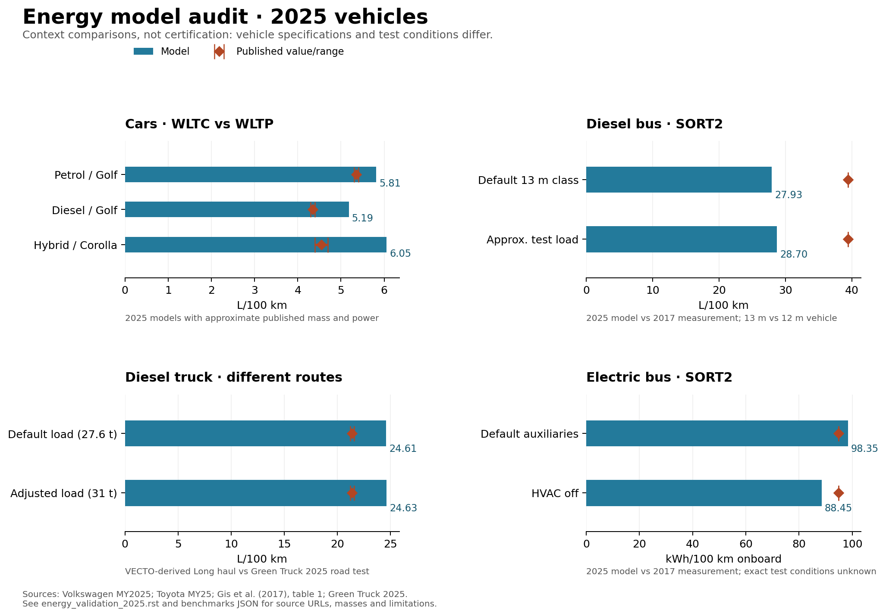

Energy-model audit: 2025 cars, buses and trucks
===============================================

.. note::

   This page records the pre-fix audit. See :doc:`energy_model_repairs` for
   subsequent corrections, explicit 2025 inputs and updated comparison results.

Audit date: 6 October 2026. **The current evidence does not establish robust fuel
consumption.** Full model runs complete, but independent checks expose errors in
power/energy accounting and several public input contracts. Some aggregate values
are plausible while compensating errors remain possible. Correct the mechanics
before adjusting efficiency maps to match observations.

The audit completed 54 deterministic vehicle-model runs: 26 default configurations,
three car specification approximations, nine SORT bus cases, one truck load
adjustment, and 15 temperature/road-load sensitivities. All returned finite
second-by-second energy arrays. One configuration is infeasible and excluded from
comparisons: the 18 t electric truck sized for 800 km exceeds its gross mass.
Its public TtW energy is zeroed by the compliance check while its electricity
consumption remains nonzero; neither is a usable prediction for that vehicle.

Of 11 targeted analytical/API checks, two pass and nine reproduce defects or
contract inconsistencies. These are deliberately diagnostic checks, not a random
sample of overall software quality. The two existing car energy tests also pass;
they check shape agreement and a simple auxiliary calculation, not these issues.

Methods and scope
-----------------

* Python 3.12.13, NumPy 1.26.4, matching local source packages. Repository commits,
  versions and SHA-256 hashes of model files and relevant parameter/cycle resources
  are in the downloadable provenance manifest.
* Static default inputs for 2020 and 2030 are interpolated to 2025 **before**
  construction and ``set_all()``. The shipped input tables have no native 2025
  column. Each case runs the complete vehicle sizing/energy pipeline, including
  its derived mass, range, costs and emissions steps. LCA inventory calculations
  are outside this fuel-consumption audit.
* Default country is CH and default fuel blends are retained. Generic class
  geometry, rolling resistance, auxiliaries and engine maps remain unchanged
  unless an override is explicitly recorded. No input is fitted to observed
  fuel consumption. Static energy calculations are deterministic; this does not
  assert deterministic stochastic or cost calculations elsewhere in the packages.
* Cars use the bundled WLTC profile: 23.262 km, 1,801 finite one-second samples.
  WLTP published consumption additionally depends on test mass, measured road
  load, vehicle control and test conditioning. Matching the cycle name alone is
  insufficient to reproduce homologation.
* Default bus and truck cycles are the bundled VECTO-derived profiles, including
  their gradients. The 40 t Long haul profile covers 108.223 km. Bus columns
  contain substantial zero padding: for the 13 m city bus the last motion is at
  second 8,129, versus 17,918 stored samples. Raw array length is not unambiguously
  operating duration. The runner records finite length, last motion, trailing
  zeros and both corresponding mean speeds without silently choosing one.
* SORT bus runs use the car resource's SORT speed arrays with flat gradients and
  bus-specific efficiency maps. A local constructor adapter injects those arrays
  into the otherwise unchanged full BusModel pipeline. This is needed because
  its public NumPy custom-cycle path currently fails. SORT2 is 0.938 km and 183
  samples, versus 0.920 km nominal in the cited paper; it is an approximation,
  not the paper's measured speed trace. Genuine final stops remain in the arrays,
  although the current operating-time mask excludes them.
* Fuel is reported in L/100 km, using ``fuel consumption * 100``. Independent
  conversion from TtW energy agrees within floating-point rounding:

  .. math::

     C_{fuel} = \frac{E_{TtW}\;[\mathrm{kJ/km}]}{10\,LHV\;[\mathrm{MJ/kg}]\,\rho\;[\mathrm{kg/L}]}.

* Electric consumption at the model's charging boundary is
  ``electricity consumption * 100`` kWh/100 km. Onboard comparisons use
  ``TtW energy / 36``. The latter avoids adding charging losses to an onboard
  measurement, but exact battery/meter boundaries still need verification.

Published comparisons
---------------------

For an expanded catalog of measured fuel and electricity consumption, including
electric cars, SORT buses, fleet weather observations and loaded electric trucks,
see :doc:`energy_measurements`. Those additional observations retain their actual
test dates and conditions and have not been scored against the runs below.

The following figures use approximate published mass/power for cars, an approximate
test load for the diesel bus, and a 31 t combination mass for the truck.
Differences are relative to the reported value/range, not uncertainty intervals or
validated prediction errors. There is no defensible pooled accuracy score across
these heterogeneous tests.

.. list-table:: Selected comparisons
   :header-rows: 1
   :widths: 26 14 16 14 30

   * - Vehicle / cycle
     - Model
     - Published
     - Difference
     - Comparability
   * - Petrol car / WLTC
     - 5.81 L/100 km
     - 5.3–5.4
     - +7.7–9.7%
     - Golf MY2025; approximate specification
   * - Diesel car / WLTC
     - 5.19 L/100 km
     - 4.3–4.4
     - +17.9–20.6%
     - Golf MY2025; approximate specification
   * - Petrol hybrid / WLTC
     - 6.05 L/100 km
     - 4.4–4.7
     - +28.8–37.6%
     - Corolla MY25; generic hybrid control
   * - Diesel bus / SORT2
     - 28.70 L/100 km
     - 39.4
     - −27.2%
     - 2017 measurement; approximate test load
   * - Electric bus / SORT2
     - 98.35 kWh/100 km
     - 94.9
     - +3.6%
     - 2017 measurement; default model auxiliaries
   * - Diesel truck / Long haul
     - 24.63 L/100 km
     - 21.20–21.59
     - +14.1–16.2%
     - Different route; context only

**Cars.** Volkswagen reports the petrol and diesel values for its 85 kW manual
Golf variants. The adjusted runs assume published minimum masses of 1,307 and
1,387 kg are curb masses and add a 75 kg driver. Published mass definitions and
actual homologation test masses are not fully matched. The Toyota case uses
103 kW and the midpoint of its 1,345–1,410 kg curb-mass range, plus a driver.
Default class runs give 6.21 petrol, 5.50 diesel and 6.08 hybrid L/100 km.
The small generic hybrid saving relative to petrol warrants a separate
charge-sustaining hybrid-control validation; the common gasoline efficiency map
does not represent Toyota's specific engine and power-split strategy.
Sources: `Volkswagen Golf MY2025 technical data <https://cenniki.volkswagen.pl/Golf-2025.html>`_
and `Toyota Corolla MY25 brochure, pages 2 and 4 <https://www.toyota.co.uk/content/dam/toyota/nmsc/united-kingdom/brochure/corolla.pdf>`_.

**Buses.** Gis et al. measured 39.4 L/100 km diesel and 94.9 kWh/100 km electric
on SORT2. These are historical 2017 observations, not 2025 vehicle tests. The
diesel approximation uses 10,600 kg curb mass, nominal 3,200 kg load and 209 kW;
vehicle-specific load corrections and HVAC state are incompletely reported.
HVAC is disabled in this approximation. The default 13 m class, carrying only
920 kg of passengers/luggage, gives 27.93 L/100 km. For electric buses, disabling
HVAC changes onboard consumption from 98.35 to 88.45 kWh/100 km. The apparent
agreement depends on unmatched conditions; neither bus result validates a 2025
fleet. Source: `Gis et al., Studies of energy use by electric buses in SORT tests,
table 1, DOI 10.19206/CE-2017-323 <https://www.combustion-engines.eu/pdf-116726-45973?filename=Studies+of+energy+use+by.pdf>`_.

**Trucks.** Green Truck 2025 reports 21.20 for Volvo, 21.50 for Scania and 21.59
L/100 km for DAF, excluding AdBlue, at 31 t and about 80 km/h on a 342.8 km route.
Payload adjustment brings model mass to 31,000.3 kg. Its different Long haul
profile averages 66.88 km/h across finite stored samples, or 71.32 km/h through
last motion. The default run weighs 27.63 t and gives 24.61 L/100 km. The tiny
fuel change when adding 3.37 t should be investigated alongside clipping and
load-map behavior; it is not evidence of accurate load sensitivity. Source:
`Green Truck 2025 test report, PDF page 8 <https://www.volvotrucks.nl/content/dam/volvo-trucks/markets/netherlands/magazine-online/2025/green-truck/Trucker%20No%208%202025%20Supertest%20Volvo%20FH%20Aero%20English%20Doppelseiten.pdf>`_.

Review findings, in priority order
----------------------------------

1. **Propulsion input energy is capped at rated shaft power.** In
   ``energy_consumption.py:567``, wheel demand is divided by conversion
   efficiencies; at line 674 that input power is capped at ``engine_power``.
   The requested speed trace is retained even when energy disappears.
   An analytical vehicle needing 12.60 kW at its wheels with 25% efficiency
   requires 50.41 kW of fuel input. With a feasible 20 kW shaft rating the
   implementation returns only 20 kW. This is an energy-boundary error.

   The cap removes 26.7% of propulsion input in the default compact diesel and
   24.5% in the city diesel bus, even though neither exceeds shaft-power capacity
   on its cycle. It removes 17.8% for the default 40 t diesel Long haul run.
   Holding vehicle sizing and returned efficiencies fixed, adding back the
   removed input changes fuel consumption from 5.50 to 7.43, 29.23 to 37.90,
   and 24.61 to 29.59 L/100 km respectively. These are diagnostic balances,
   **not corrected model predictions**: the load calculation and maps also need
   attention. A physically infeasible cycle needs an explicit feasibility result
   or a forward speed solution, not silent deletion of energy.

2. **Engine load uses input rather than shaft output; iteration has no convergence
   test.** Line 573 divides fuel-side power by rated shaft power. The map files
   describe output/max-output load. The analytical case returns 5.04% load where
   1.26% is expected. The loop at line 543 always performs eight updates.
   A ninth map evaluation changes individual active-point engine efficiencies by
   up to 0.178 (compact diesel), 0.392 (city diesel bus), and 0.398 (40 t diesel);
   mean absolute changes are 0.00245, 0.00914 and 0.00557 respectively.
   Last-motion mask artifacts are excluded from these residuals.
   Define the load boundary first, then solve or eliminate the implicit relation
   with explicit residual checks. Revisit calibration after this change.

3. **Auxiliary and HVAC boundaries are inconsistent.** Lines 340 and 628 take
   different conversion paths and suppress base auxiliary power at stops.
   With 1 kW auxiliary demand and 25% generation efficiency, no-HVAC accounting
   requires 4 kW input; merely supplying zero HVAC power returns 1 kW.
   A two-second stop consumes zero instead of the specified constant 2 kJ load.
   Specify electrical/mechanical/thermal boundaries and engine-on/stop-start
   behavior. A 5% idle-load value by itself does not create idle fuel use.

4. **Zero recuperation efficiency becomes one.** Line 552 replaces zero by one;
   a simple braking test recovers 75 kJ despite explicitly disabled recuperation.
   Treat zero as physically meaningful and separately represent missing values.
   Recovery also needs motor, inverter and battery boundaries, power limits and
   state-of-charge constraints appropriate to each powertrain.

5. **Gradient units disagree with the public contract.** The constructor documents
   degrees at line 141 while force uses ``sin(gradient)`` directly. A documented
   one-degree incline produces 343.95 kW instead of 7.13 kW in the analytical
   case. This proves the custom-input mismatch; it does not prove the bundled
   gradients are stored in degrees. Establish their provenance before converting
   any resource values. A supplied gradient is also ignored when cycle is a name.

6. **Time masks and input validation need explicit contracts.** Line 311 excludes
   the final moving sample and all later stationary samples; supplied SORT2 has
   19 trailing stopped seconds. Padding and real stopped time must be distinguished
   using cycle duration metadata. NaN driving mass is not rejected and final
   ``fillna(0)`` can hide invalid demand. Validate finite, physically bounded
   inputs before evaluating energy and reject zero-distance cycles explicitly.

7. **Several public controls do not reach the calculation.** Car and truck
   constructors accept ambient temperature but do not forward it to their energy
   model; changing it from −10 to 35 °C produces identical fuel consumption.
   Their fixed auxiliary-demand parameters still operate. Engine/transmission
   efficiency override dictionaries are stored in the base constructor but are
   not consumed by these subclasses' energy calls. BusModel's ``if not self.cycle``
   at line 66 rejects a NumPy speed array with an ambiguous-truth ValueError.

8. **Operating assumptions need a second validation layer.** Bus daily distance
   uses mean speed with stops removed (``bus/model.py:771``), so operation-time
   semantics affect battery sizing. The audit does not certify cold-start fuel,
   accessory control, transient engine behavior or hybrid charge balance.
   Truck/bus maps cite VECTO simulations: agreement with the same calibration
   source would not constitute independent external validation.

Sensitivity results
-------------------

Full reruns with 10% higher aerodynamic drag increase consumption by 0.47% for
the compact diesel, 0.93% for the electric city bus and 1.57% for the 40 t diesel.
Increasing rolling resistance by 10% changes these by −0.16%, +2.17% and +0.72%.
The small negative car response needs investigation; load-map nonlinearities,
clipping and incomplete convergence prevent interpreting it as a robust physical
sensitivity.

Electric city-bus charging consumption is 132.29, 119.72 and 192.34 kWh/100 km at
−10, 20 and 35 °C. This tests response direction and magnitude under current
assumptions; it does not validate HVAC against measured seasonal data. The car
and diesel-truck temperature runs are identical at every tested temperature.

All baseline configurations
---------------------------

Electricity below is at the model's charging boundary, whereas the electric-bus
comparison above uses onboard TtW energy. Vehicle size labels denote classes,
not actual driving masses. The infeasible 18 t BEV Long haul row is marked and
its consumption is omitted from this presentation.

.. csv-table:: Default 2025 full-model runs
   :file: _static/energy_validation_2025/baselines.csv
   :header-rows: 1

Reproduction and next steps
---------------------------

Install matching source checkouts in a Python 3.12 environment, then run from
``carculator_utils``:

.. code-block:: bash

   python -m pip install -e . -e ../carculator -e ../carculator_bus -e ../carculator_truck
   python scripts/validate_energy_2025.py --output /tmp/energy-audit-new
   # Optional plotting, in an environment with matplotlib:
   python scripts/plot_energy_validation.py /tmp/energy-audit-new

Use a new output directory. The audit intentionally exits with status 1 when a
physics/API check fails; this run has no model-run exceptions. It writes full
scalar results, comparison calculations, provenance and separate run logs.
External benchmark values are versioned in ``scripts/energy_benchmarks_2025.json``;
the reproducer does not download changing web pages or fit model parameters.

The next implementation should first add regression tests and repair power/load
boundaries, convergence, auxiliary accounting and zero-efficiency handling.
Then fix cycle/time/input contracts and supported overrides. Only afterwards
re-estimate efficiency maps and validate on independent, held-out observations
with known speed/gradient traces, mass, power, fuel, temperature, auxiliaries and
measurement boundary. Obtain contemporary SORT/eSORT tests and an actual truck
test trace before claiming 2025 fleet accuracy. Keep generic-class plausibility,
matched-vehicle validation and uncertainty analysis distinct.

Downloads:

* :download:`All 54 runs (CSV) <_static/energy_validation_2025/runs.csv>`
* :download:`Comparison calculations (JSON) <_static/energy_validation_2025/comparisons.json>`
* :download:`Analytical/API checks (JSON) <_static/energy_validation_2025/physics_checks.json>`
* :download:`Source and resource provenance (JSON) <_static/energy_validation_2025/provenance.json>`
* :download:`Benchmark observations and assumptions (JSON) <_static/energy_validation_2025/benchmarks.json>`
* :download:`Comparison figure (PDF) <_static/energy_validation_2025/comparison.pdf>`

This audit adds a reproducer, observations and documentation. Production physics
and parameter defaults are unchanged, preserving the reviewed baseline for the
subsequent fixes.
