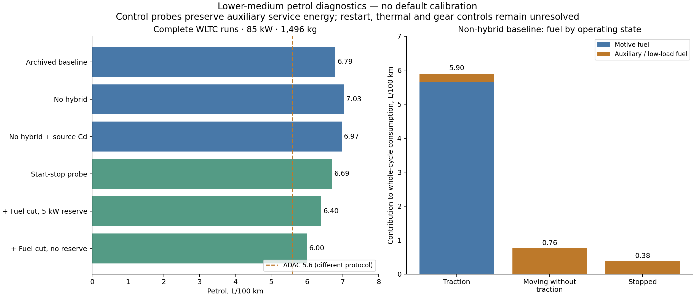

Lower-medium petrol cars: Golf energy diagnostics
=================================================

The strongest diagnostic lead is **engine operation at stops and during
braking**, followed by the effective engine/transmission model. Thirteen full
2025 vehicle runs reproduce the earlier Golf result and isolate these effects.
No production defaults or physics were changed; the controller experiments
remain explicitly limited research probes.

Evidence and comparison boundary
--------------------------------

The `December 2024 ADAC test <https://www.adac.de/rund-ums-fahrzeug/autokatalog/marken-modelle/vw/golf/viii-facelift/332971/>`_
reports 5.6 L/100 km combined for the 85 kW Golf 1.5 TSI Life, with urban,
rural and motorway values of 5.9, 5.0 and 6.3. It explicitly distinguishes this
manual car from the mild-hybrid automatic variants.
The `full report <https://assets.adac.de/image/upload/Autodatenbank/Autotest/at6463-vw-golf-15-tsi-life/vw-golf-15-tsi-life.pdf>`_
confirms functioning start-stop on page 8. Page 13 gives measured curb mass
1,296 kg, a six-speed manual gearbox, and manufacturer drag coefficient 0.28;
frontal area and measured dynamometer road-load coefficients are not supplied.
We retain the documented mass reconstruction of curb mass plus 200 kg payload:
1,496 kg driving mass. It is not a vehicle-specific weighed test mass.

The `2021 ADAC protocol <https://assets.adac.de/image/upload/v1721027897/ADAC-eV/KOR/Text/PDF/ecotest-methodik-ab-04-2021_pg5juw.pdf>`_
combines 70% of the mean cold/hot WLTC consumption with 30% ADAC motorway
consumption. The motorway test includes vehicle-dependent full-load
accelerations. Its numerical vehicle trace, cold/hot fuel results and road-load
settings have not been obtained. The earlier electric-cycle reconstruction is
not the combustion test and is not used here. These WLTC runs therefore remain
screening comparisons; neither the individual WLTC phases nor their arithmetic
average should be presented as ADAC's urban/rural/motorway results.

Configuration and sensitivities
-------------------------------

All rows after the archived baseline remove the generic electric power share,
so the engine supplies the documented 85 kW without regenerative assistance.
Other probes each start from that non-hybrid configuration unless stated.
All consumption values are L/100 km on the same complete WLTC.

.. list-table:: Full-run results
   :header-rows: 1

   * - Configuration
     - Consumption
     - Interpretation
   * - Archived baseline
     - 6.792
     - Includes generic 2.125 kW electric power
   * - Non-hybrid configuration
     - 7.035
     - Correcting technology increases consumption
   * - Source drag coefficient 0.28
     - 6.968
     - Small effect; frontal area remains generic
   * - Rolling coefficient reduced 20%
     - 6.832
     - Hypothetical sensitivity
   * - Drag coefficient reduced 20%
     - 6.639
     - Hypothetical sensitivity
   * - Driving mass reduced / increased 75 kg
     - 6.863 / 7.209
     - Illustrative mass sensitivity
   * - Auxiliary power halved
     - 6.972
     - Small change despite large auxiliary fuel allocation
   * - Effective transmission efficiency 0.90 / 0.95
     - 6.439 / 6.197
     - Hypothetical component split, not measured gearbox data
   * - Start-stop service-buffer probe
     - 6.694
     - Auxiliary energy repaid during traction
   * - Start-stop plus overrun, 5 kW mechanical reserve
     - 6.399
     - Fuel cut only during stronger braking
   * - Start-stop plus overrun, no mechanical reserve
     - 6.000
     - More optimistic idealized fuel-cut eligibility

The original +21.3% screening deviation becomes +25.6% after removing hybrid
assistance. Correcting the documented drag coefficient changes consumption by
only 0.067 L/100 km. Thus neither this known road-load adjustment nor removal
of the inappropriate hybrid assistance explains away the original shortfall
in predicted efficiency.

The 0.8 transmission parameter belongs to an effective split of a fleet-level
tank-to-wheel curve in ``data/efficiency/car.yaml``. It is not evidence that the
Golf's manual gearbox loses 20% of its mechanical input. Raising it alone
changes the original effective fit; the sensitivity does not justify a new
universal gearbox default. A measured engine map and a compatible driveline
loss model would be preferable.

Operating-state accounting
--------------------------

The non-hybrid baseline partitions exactly as follows. Values are contributions
to the whole cycle's L/100 km, not consumption normalized by each state's distance.

* Positive traction, 1,093 seconds: 5.657 motive fuel plus 0.242 auxiliary fuel.
* Moving without positive traction, 473 seconds: 0.758 auxiliary fuel.
* Stopped, 235 seconds: 0.377 auxiliary fuel.

The last two states account for **1.135 L/100 km**. This is a diagnostic fuel
allocation, not an amount that can simply be deleted. The low-load efficiency
curve assigns engine losses to the auxiliary term when traction vanishes.
Halving the 362 W service demand barely changes fuel because the first segment
of the efficiency curve is approximately proportional to load, leaving an
almost constant low-load fuel rate. Consequently, a large auxiliary fuel term
does not demonstrate excessive accessory wattage.

The control probes retain the same wheel demand, mass, engine map and baseline
transmission assumption. At stops, a notional buffer supplies the auxiliary
load; subsequent traction repays the borrowed energy with 75% round-trip
efficiency. For overrun, braking mechanical energy can supply the service load
through an assumed 80% reverse transmission efficiency. A 0 or 5 kW reserve
changes eligibility from 433 to 184 seconds. Both choices are engineering
sensitivities, not measured Golf thresholds or confidence limits.

Each run checks an explicit service ledger: engine-funded service plus
kinetic-funded service equals delivered service plus buffer losses. No auxiliary
service is deleted and no recovered energy is credited twice. These probes omit
restart fuel, engine-speed and gear thresholds, catalyst/temperature vetoes,
finite buffer capacity and time-resolved battery state. They must not be
promoted directly into generic defaults. The `EPA transient-engine study
<https://www.epa.gov/sites/default/files/2017-06/documents/sae-2017-01-0533-characterizing-factors-influencing-si-engine-transient-fuel-consumption-alpha.pdf>`_
particularly cautions that fueling after deceleration fuel cut can increase to
restore catalyst operation; instantaneous fuel cut alone is incomplete.

Next implementation priority
----------------------------

Introduce explicit, energy-conserving engine operating modes with opt-in
start-stop and deceleration fuel cut, independently test their transitions,
and validate against time-resolved fuel/engine-speed evidence. Establish how
the effective fleet curve already incorporates control losses before replacing
or supplementing it. In parallel, obtain Golf-specific road load and the
combustion ADAC trace. A class-wide efficiency multiplier fitted to 5.6 L/100 km
would conceal these unresolved mechanisms and is not supported by this audit.

Reproduction
------------

With all matching vehicle packages installed, run from the shared repository::

   python scripts/diagnose_petrol_car_energy.py --output /tmp/golf-diagnostics-new
   python scripts/plot_petrol_car_diagnostics.py /tmp/golf-diagnostics-new

The output directory must be new. Full ``set_all()`` runs verify the archived
baseline, driving mass within 0.1 kg, eligibility, absence of unmet power,
zero electric power in the non-hybrid cases, exact operating-state partitions,
and fuel/service energy accounting. The
:download:`results <_static/energy_validation_2025/petrol_diagnostics/runs.json>`
and :download:`provenance <_static/energy_validation_2025/petrol_diagnostics/provenance.json>`
record configurations, references and hashes. Active per-second traces and
logs are archived alongside them. Temporary auxiliary/controller hooks are
described by each variant; the scalar vehicle parameters in the run record
precede these hooks.
