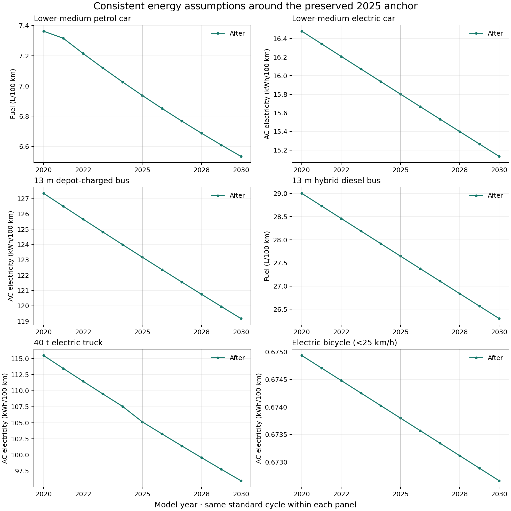

Energy assumptions around the 2025 anchor
=========================================

The 2025 energy audit introduced component assumptions and a limited bus calibration.
Leaving these assumptions confined to 2025 created artificial temporal features.
The revised inputs preserve **every 2025 nominal value and uncertainty
distribution**, while making their interpretation consistent across years.
These changes affect historical estimates and projections; they are not new
measurements or validation of every vehicle in every year.

What changed
------------

The four vehicle packages now carry explicit motor/inverter efficiency (0.90),
electric transmission efficiency (0.97), and, where applicable, independent
hybrid motor peak/system-power ratio (0.65) at every tabulated year from 2000 to
2050. The bus hybrid combustion peak/system-power prior is 0.70 throughout.
These component/architecture assumptions are held constant because we have not
established a defensible technology-specific trend for them.

This also repairs a severe interpolation problem. Missing component inputs were
stored as zero outside 2025. For example, linear interpolation from zero in
2020 to motor efficiency 0.90 in 2025 produced 0.18 in 2021. Because the model's
fallback applies only at zero, that nonzero value became an actual efficiency.
The same problem affected the electric transmission override. The combination
produced extreme consumption or failure of vehicle sizing.

Battery and charger efficiencies retain the relative shape of their legacy
**losses**, rebased on the 2025 component assumption:

.. math::

   \eta_{new}(y) = 1 - [1-\eta_{2025}]
      \frac{1-\eta_{legacy}(y)}{1-\eta_{legacy,2025}}

Here the legacy 2025 reference is the midpoint of its original 2020 and 2030
values, excluding the subsequently introduced 2025 prior. An absent, zero or
ideal legacy efficiency provides no usable loss trend; in that case the
component assumption is held constant. Missing depleted-PHEV discharge records use
the paired electric-mode battery's legacy trend. Every resulting efficiency is
checked to remain in (0, 1]. This is a transparent engineering transfer of trend
shape between component definitions, not evidence that the historical component
efficiencies were measured separately.

For example, the car battery charge prior is 0.984598, 0.984886 and 0.985174 in
2020, 2025 and 2030. Charger conversion remains separate from internal storage
losses. Interpolation stays linear between tabulated years; no spline,
overshoot-prone fit, or universal monotonic-energy constraint is introduced.

The 13 m city BEV base auxiliary prior is **8.3 kW from 2020 through 2050**,
instead of 5 / 8.3 / 5 kW in 2020 / 2025 / 2030. Applying the transfer from 2020
is consistent with the vintage of its Gillig test source. Future persistence is
an explicit assumption. The 2000 and 2010 anchors retain their previous values;
other bus sizes and combustion buses retain their previous auxiliary inputs.
Heating and cooling remain separately modelled.

The triangular 6.225–10.375 kW bounds are an engineering uncertainty envelope,
not a confidence interval inferred from multiple buses. The records share an
``uncertainty_group`` so a stochastic trajectory uses the same draw across
2020, 2025, 2030, 2040 and 2050, and across the three charging strategies. This
avoids manufacturing independent year-to-year noise from a single uncertain
assumption. Groups require identical sampling distributions. Ungrouped records
retain independent sampling, and the local seeded RNG contract is unchanged.

Full-model results
------------------

The audit constructs full vehicles on annual inputs from **2015 to 2040**:
21 configurations spanning petrol/diesel, hybrid, plug-in hybrid operating modes,
BEV and fuel-cell cars, buses and trucks, plus combustion/electric two-wheelers.
Each configuration retains its standard driving cycle across years; trucks use
the default urban-delivery cycle. This comparison diagnoses temporal consistency,
not agreement with an external fuel-consumption observation.

All **546 revised vehicle-year cases complete**. Availability rules are retained:
masked historical configurations are recorded with zero consumption and are not
interpreted as functioning vehicles. The original input definitions cause **20
sizing failures** in this grid; the revised inputs cause none. Before/after
runs share the current production physics, isolating the input-data changes.

.. list-table:: Selected revised consumption on unchanged cycles
   :header-rows: 1
   :widths: 43 18 13 13 13

   * - Vehicle
     - Unit
     - 2020
     - 2025
     - 2030
   * - Lower-medium petrol car
     - L/100 km
     - 7.363
     - 6.938
     - 6.534
   * - Lower-medium BEV car
     - AC kWh/100 km
     - 16.480
     - 15.802
     - 15.132
   * - 13 m depot-charged bus
     - AC kWh/100 km
     - 127.344
     - 123.176
     - 119.166
   * - 40 t BEV truck
     - AC kWh/100 km
     - 115.466
     - 105.143
     - 95.978
   * - Electric scooter <4 kW
     - AC kWh/100 km
     - 2.498
     - 2.500
     - 2.502

   Representative trajectories after harmonization. A small increasing trend,
   such as the electric scooter's, is allowed where other vehicle inputs imply it.

The :download:`before/after chart <_static/energy_validation_2025/temporal/annual_energy.png>`
shows the former interpolation failures and extreme values; those old values
are numerical consequences of inconsistent input definitions, not credible
physical consumption estimates.

All **40 existing measurement-comparison model runs reproduce exactly** their
previous 2025 TtW energy, fuel use, electricity use, battery-terminal energy and
driving mass. Separate 2025-only before/after runs also preserve outputs for all
21 temporal-audit configurations. Multi-year batches can retain small numerical
sizing differences because convergence stops when every cell meets tolerance;
the anchor-preservation check therefore uses independent 2025 runs rather than
claiming bitwise equality between differently converging batches. For the
fuel-cell truck, tightening the audit sizing tolerance to 1e-8 reduces the
before/after batch residual at 2025 from about 0.17% to below 1e-7%.
Production sizing tolerances are unchanged.

The largest revised year-to-year TtW change over 2020–2030 is 6.64% for the diesel
city bus in 2021. It comes from the existing non-calibrated trajectory; it is not
an isolated 2025 feature. The corresponding maximum is 2.24% for the electric
truck, 0.87% for the electric car and 0.67% for the depot-charged bus. Discrete
availability and chemistry choices remain model policies, and are not smoothed
away to meet a numerical target. No new consumption calibration was performed.

Reproduction and provenance
---------------------------

Each vehicle package includes ``data/temporal_energy_provenance.json`` with the
original affected records and their ordering, original file hash, new record
identifiers, methods and references to the preserved 2025 anchor records. The
shared staging script can restore the original mapping for comparison. It checks
that unaffected effective cells retain their values, including legacy first-entry
precedence, and refuses to harmonize already-harmonized data a second time.

Use matching Python 3.12 family checkouts::

   python scripts/harmonize_energy_time_trends.py --output /tmp/temporal-staging
   python scripts/audit_energy_time_trends.py --output /tmp/temporal-audit
   python scripts/plot_energy_time_trends.py \
       --results /tmp/temporal-audit/runs.json --output /tmp/annual_energy.png

The staging command expects the original inputs; on revised packages use the
script's ``restore(records, manifest)`` helper first. It writes a reviewable
staging directory, never directly overwrites sibling packages. The audit uses
the packaged restoration metadata automatically. Its ``--resume`` option checks
the saved runtime, model-code and resource hashes before reusing completed cases.

The array builder accepts tabulated years. Build an array containing the bracketing
tabulated years, then interpolate it before constructing the model::

   inputs.static()
   _, native = fill_xarray_from_input_parameters(inputs, scope=scope)
   annual = native.astype(float).interp(year=range(2020, 2031))
   model = VehicleSpecificModel(annual)
   model.set_all()

Saved artifacts:

* :download:`Annual model outputs <_static/energy_validation_2025/temporal/runs.json>`
* :download:`Changes and input hashes <_static/energy_validation_2025/temporal/summary.json>`
* :download:`Independent 2025 checks <_static/energy_validation_2025/temporal/anchors_2025.json>`
* :download:`Measurement-catalog regression <_static/energy_validation_2025/temporal/measurement_recheck.json>`

* :download:`Fuel-cell sizing sensitivity <_static/energy_validation_2025/temporal/fcev_tight_sizing.json>`

Verification on Python 3.12: **436 tests passed**, with one existing two-wheeler
expected failure. All five installed wheels and source-distribution-built wheels
passed packaged-resource hash checks and offline model/LCIA smoke tests. Sphinx
HTML built successfully with its 40 existing warnings and no new warnings.

* :download:`Runtime and source hashes <_static/energy_validation_2025/temporal/runtime_provenance.json>`
* :download:`Artifact verification <_static/energy_validation_2025/temporal/verification.json>`
