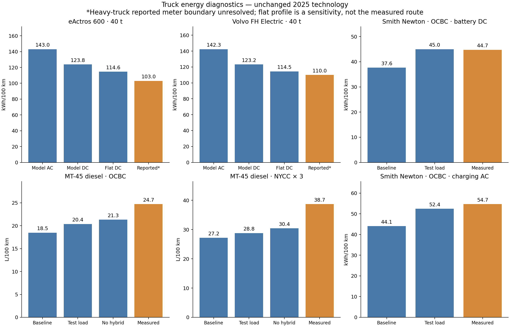

Truck energy diagnostics: road loads and measurement boundaries
===============================================================

Twenty complete model runs separate test configuration from generic 2025
technology assumptions. No production code or default parameters were changed.
The strongest result is that the Smith Newton battery-energy discrepancy almost
disappears when the documented laboratory road load is used. The historical
MT-45 diesel remains substantially low, particularly on NYCC.

Delivery trucks: matching the dynamometer
-----------------------------------------

The `Smith Newton report <https://calstart.org/wp-content/uploads/2018/10/Battery-Electric-Parcel-Delivery-Truck-Testing-and-Demonstration.pdf>`_
(Appendix B, printed page 15, PDF page 143, Table 4) supplies a laboratory
road-load polynomial. The `NREL MT-45 report <https://docs.nlr.gov/docs/fy11osti/48896.pdf>`_
(printed page 33, Vehicle Simulation) supplies another. We apply these directly:

* Smith: F = 97.41 + 0.1071 v².
* MT-45: F = 147.70 - 1.35 v + 0.100 v².

Here F is pounds-force and v is miles/hour. The Smith linear coefficient is
numerically negligible (-7e-14). Its curve independently reproduces the source's
48.7 hp at 50 mph. Smith's load was calculated by the frontal-area method;
MT-45's was derived from approximate local coastdowns and prior coefficients.
These are documented test settings, not independent measurements of tire and
aerodynamic coefficients.

Driving masses are the documented test inertias: 13,175 lb for Smith and
11,500 lb for MT-45. Power, battery capacity and existing catalog overrides
are retained. All runs use 2025 model technology, so matching the laboratory
load does not recreate every feature of these historical vehicles.

.. list-table:: Delivery-truck results
   :header-rows: 1

   * - Vehicle / cycle / boundary
     - Generic load
     - Source load
     - Source load, no hybrid
     - Measured
   * - Smith / OCBC / battery DC, kWh/100 km
     - 37.64
     - 44.99
     - —
     - 44.74
   * - Smith / OCBC / charging AC, kWh/100 km
     - 44.06
     - 52.42
     - —
     - 54.68
   * - MT-45 / OCBC / L/100 km
     - 18.48
     - 20.37
     - 21.32
     - 24.71
   * - MT-45 / NYCC × 3 / L/100 km
     - 27.16
     - 28.80
     - 30.42
     - 38.69

Smith's residual is +0.6% at the battery terminals and -4.1% for charging
energy. Table 3-4 reports 0.72 DC and 0.88 AC kWh/mile. The source's roughly
81.8% OCBC ``charging efficiency`` is drive DC energy divided by subsequent
AC recharge energy, not an isolated charger conversion efficiency. Battery
losses and recharge accounting must also be considered before altering a
charger parameter. HVAC and fans were off in the test; other auxiliary loads
are not established, so we did not force all Smith auxiliary demand to zero.

The generic 2025 diesel class includes a small electric power share. Removing
it is appropriate for this conventional historical MT-45 comparison, and
reduces the shortfall to 13.7% on OCBC and 21.4% on NYCC. Engine efficiency,
idling and transmission control are the next diagnostic targets. The evidence
does not justify fitting a generic 2025 diesel to a 2006 vehicle tested in 2009.

Heavy BEVs: boundary and route remain unresolved
------------------------------------------------

`Daimler's European tour <https://www.daimlertruck.com/en/newsroom/events/2024/eactros-600-european-testing-tour-2024>`_
reports 103 kWh/100 km over 15,269 km at 40 t. The vehicle used efficiency-oriented
configuration and tires. `Volvo's Green Truck test <https://www.volvotrucks.com/en-en/news-stories/press-releases/2022/jan/volvos-heavy-duty-electric-truck-is-put-to-the-test-excels-in-both-range-and-energy-efficiency.html>`_
reports 110 kWh/100 km over 343 km, averaging 80 km/h at 40 t.
Neither source establishes a sufficiently precise electrical meter boundary.
Consequently, both model AC and battery-terminal DC are retained below; the
reported figures must not silently be relabeled as either.

.. list-table:: Heavy BEV sensitivities, kWh/100 km
   :header-rows: 1

   * - Configuration
     - eActros 600
     - Volvo FH Electric
   * - Baseline charging AC
     - 143.00
     - 142.33
   * - Baseline battery DC
     - 123.75
     - 123.15
   * - Same speeds, zero grade, DC
     - 114.61
     - 114.46
   * - Rolling resistance reduced 20%, DC
     - 112.85
     - 112.24
   * - Drag coefficient reduced 20%, DC
     - 115.73
     - 115.13
   * - Auxiliaries disabled, DC
     - 115.53
     - 114.93
   * - Steady 80 km/h, flat, DC
     - 110.30
     - 110.30
   * - Reported, boundary unresolved
     - 103.00
     - 110.00

Each sensitivity changes one baseline condition independently. The steady
profile has no acceleration from rest. None reproduces a measured route, and
the 20% changes are hypothetical probes, not uncertainty intervals or proposed
calibrations. Agreement of steady-speed DC with Volvo's total is insufficient
for validation.

Baseline road load uses rolling coefficient 0.00475, drag coefficient 0.4615
and frontal area 10 m², with 5.875 kW auxiliary demand. The VECTO long-haul
profile covers 108.191 km with 5,454 active seconds (about 71.4 km/h including
stops). Its stored array length is not the operating duration. Net elevation
change does not capture the losses from repeated climbing and regeneration.

If the reported figures are battery-terminal DC, residuals are about +20.1%
for eActros and +12.0% for Volvo. Without that boundary confirmation, exact
route traces and vehicle-specific road loads, these remain screening checks.
The next useful evidence would be matched AC/DC meters and route elevation,
followed by manufacturer or coastdown road-load data.

Reproduction and checks
-----------------------

Run from the shared repository with all sibling packages installed::

   python scripts/diagnose_truck_energy.py --output /tmp/truck-diagnostics-new
   python scripts/plot_truck_energy_diagnostics.py /tmp/truck-diagnostics-new

The output directory must not exist. The runner uses full vehicle construction
and mass convergence, verifies every baseline against the archived 2025 run,
checks comparison eligibility and driving mass within 0.1 kg, and independently
checks the injected road-load force against returned power at every time step.
The no-auxiliaries probe asserts zero auxiliary energy. The force adapter
represents the complete source load through an equivalent time-dependent
rolling term with aerodynamic drag zeroed; this term is not a physical tire
coefficient and never enters production defaults.

Archived :download:`runs <_static/energy_validation_2025/truck_diagnostics/verified/runs.json>`
include signed component work, model outputs and configuration overrides.
The :download:`provenance <_static/energy_validation_2025/truck_diagnostics/verified/provenance.json>`
records package revisions, input hashes, source PDF hashes and table locators.
Energy-hook changes (flat grade, source load, no auxiliaries) are identified
by the variant and diagnostics; the underlying run's scalar parameters still
describe the constructed vehicle before those temporary diagnostic hooks.
