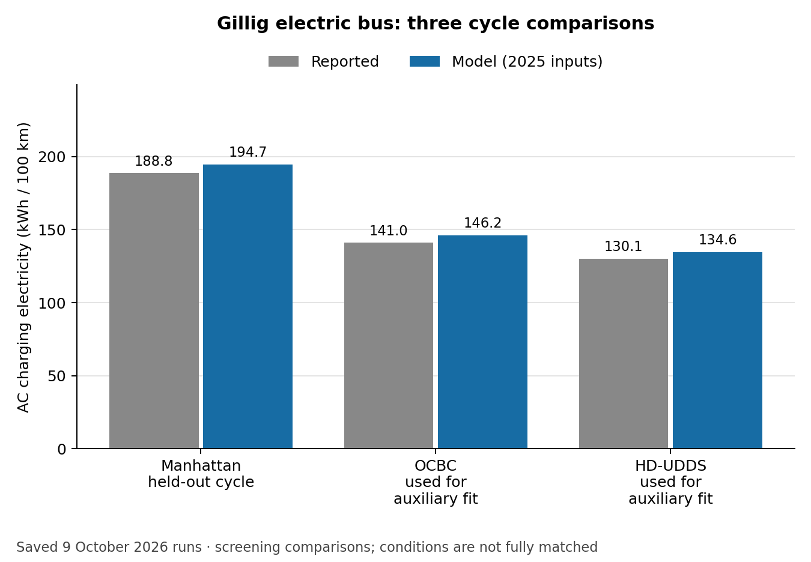
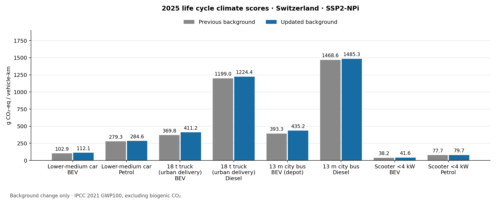

Validation examples: what the comparisons show
==============================================

A completed calculation is necessary but is not enough to establish that the
vehicle represents reality. This page separates comparisons with reported energy
use, checks of the calculation, and changes caused by the background database.
See :doc:`interpretation` for units and :doc:`validity` for detailed checks.

The figures reproduce **saved audits from October 2026**. This documentation
review replotted their recorded numbers; it did not rerun every model or fit
new parameters. Sources and software revisions belong to each audit, so these
figures should not be described as measurements of the latest software release.

How to make a fair energy comparison
------------------------------------

Match the vehicle and year, the second-by-second speed and road gradient, test
mass, resistance coefficients, temperature, auxiliary loads, and fuel or battery
properties. State where energy was measured. Charging electricity includes
losses that a battery-terminal measurement excludes. If a test mass is
reconstructed from curb mass and a documented payload, label it as reconstructed
rather than weighed.

The 9 October family evidence review retained 41 paired observations from 40
runs and excluded 77 other observations with recorded reasons. **All 41 pairs
remain screening comparisons under that review's strict matching rules.** This
is not a count of independently validated vehicles, and the earlier use of two
bus cycles to fit an auxiliary load does not change that classification.
Multiple cycles or meter locations on one vehicle share evidence.

Evidence across the vehicle family
----------------------------------

The car, truck, bus and two-wheeler sites each contain examples relevant to their
vehicles. The main evidence is complementary:

* **Cars:** reported ADAC charging and fuel consumption; WLTC and ADAC are not
  interchangeable. A separate graph-derived ADAC experiment tests cycle
  sensitivity without changing vehicle efficiencies.
* **Trucks:** Smith and MT45 dynamometer cases with documented resistance curves;
  the historical test vehicles do not represent 2025 technology directly.
* **Buses:** Gillig AC recharge measurements on three cycles; two informed the
  auxiliary assumption and one was held out on the same vehicle.
* **Two-wheelers:** manufacturer consumption reports screen petrol classes.
  Large differences remain, and matched electric-vehicle evidence is missing.

.. figure:: _static/validation/car_electricity.png
   :alt: ADAC charging consumption and WLTC model results for electric cars

   Car screening example: reported AC charging electricity versus WLTC model
   outputs. Cycles, road loads and some years differ. See :doc:`energy_measurements`
   for documented mass reconstructions and exclusions.

   Bus example: the 8.3 kW auxiliary assumption was informed by OCBC and HD-UDDS.
   Manhattan was held out on the same bus. This is not independent fleet
   validation; see :doc:`energy_model_repairs` and the bus validation page.

For the deeper experiments, see :doc:`adac_cycle_comparison`,
:doc:`truck_energy_diagnostics`, :doc:`petrol_car_energy_diagnostics`, and
:doc:`combustion_controls`. The published comparison figures remain useful,
provided their recorded conditions and dates accompany them.

Change in life cycle climate scores
-----------------------------------

The next chart compares **two calculations**, not model outputs with measured
emissions. Both use the same 2025 vehicle inputs and national electricity-supply
settings in Switzerland. Only the bundled background inventory/index and impact
coefficients were changed. The updated bundle was rebuilt with premise and
ecoinvent 3.12 cutoff. The previous bundle is identified by Git revision
``aeace0e53937870fa05ec8aeba392e41d75aaa0b``; it should not be described as a clean
older-ecoinvent baseline because it already contained some newer coefficients.

The displayed scenario is ``SSP2-NPi``. Results are grams CO2-equivalent per
vehicle-km, using IPCC 2021 GWP100 excluding biogenic CO2 within the ``recipe``
midpoint collection. Vehicle masses and consumption were unchanged: all 138
recorded physical outputs matched exactly. The full audit covers 96 combinations
of eight vehicles, three years and four background scenarios.

   Model-to-model background comparison, not measured validation.
   :download:`Values <_static/validation/climate_family.csv>`.

Traceable results
-----------------

Download the :download:`plotted values and source checksums
<_static/validation/plot_inputs.json>` and :download:`source manifest
<_static/validation/source_manifest.json>`. The JSON stores observation IDs and,
where recorded in the comparison table, original source URLs. Sources for the
reused diagnostic figures are listed in their linked method pages.

The shared `background-rebuild guide <https://github.com/Laboratory-for-Energy-Systems-Analysis/carculator_utils/blob/master/docs/background_rebuild.rst>`_ contains the
complete climate CSV, software revisions, rebuild report and comparison command.
The `energy evidence guide <https://github.com/Laboratory-for-Energy-Systems-Analysis/carculator_utils/blob/master/docs/energy_measurements.rst>`_ provides the original
measurement catalog, exclusions and run records. These are reproducibility
records, not new evidence of external accuracy.

To redraw the new bar charts from saved results, run from ``carculator_utils``
with Matplotlib installed::

   python scripts/plot_documentation_validation.py --output /tmp/validation-plots

The plotting script does not recalculate vehicles. Reproducing a model audit
requires the matching source revisions and inputs recorded in that audit.
